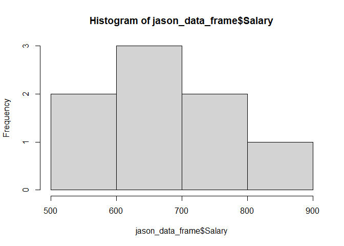
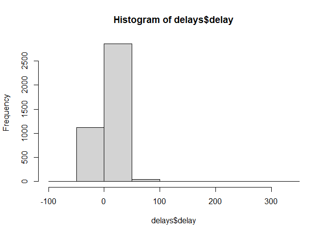
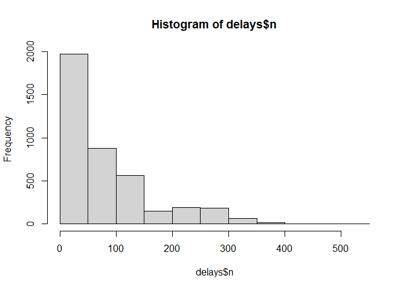
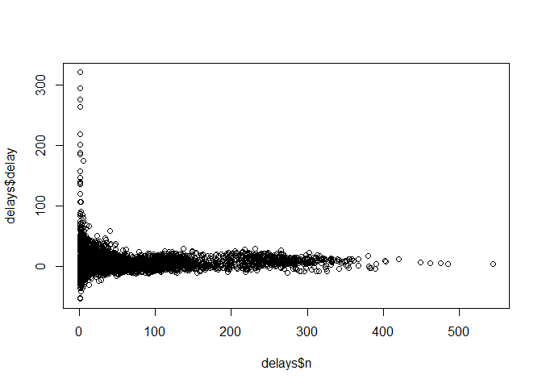

**Assignment 2: Web scrapping/Data Wrangling in R**
================
**Suman Paudel 33**
2024-03-09

[GitHub
Repository](https://github.com/sumanpaudel1997/R-For-Data-Science/tree/main)

### <span style="color:#d30000"><b> Code Execution and Output/Interpretation of Session 7</b></span>

#### **What is a “package” in R?**

- In R, the fundamental unit of shareable code/function is the package.
- A package bundles together code, data, documentation, and tests, and
  is easy to share with others.
- The public clearing house for R packages is the Comprehensive R
  Archive Network or `CRAN`. The details about the packages can be found
  at CRAN.

#### How to install, use and get help about any package from CRAN?

- We can install packages of CRAN in R using:
  **`install.packages("packagename")`**  
  For example: **`install.packages("dplyr")`**

- We can then use the installed packages in R using:  
  **`library(packagename)`**  
  **`e.g. library(dplyr)`**

- We can get help on the installed packages in R using:  
  **`?packagement`** or **`help(package = "packagement")`**  
  **`e.g. ?dplyr`** OR **`help(package = "dplyr")`**

#### How to develop a package in R?

 <https://hilaryparker.com/2014/04/29/writing-an-r-package-from-scratch/>

- Step 0: Packages you will need
- Step 1: Creating your package directory
- Step 2: Add functions
- Step 3: Add documentation
- Step 4: Process your documentation
- Step 5: Install
- Step 6: Make a package GitHub repo (Bonus!)
- Step 7: Infinity- Iterate

#### Reading (Import) data in R/R Studio:

- Text files: R base, readr etc
- Excel files: readXL, openxls etc.
- SPSS, Stata, SAS files: foreign, haven etc.

#### Reading data in R/R Studio

- JSON files: rjason, jsonlite, RJSONIO etc.

#### To install the library to work on josn files.

- `install.packages('jsonlite')`
- `install.packages('rjson')`

##### <span style="color:#7b9a26"> <b> Code Sample 1</b></span>

``` r
# vector 
library("rjson")
data <- fromJSON(file = "jason_data.json")
data
```

    ## $ID
    ## [1] "1" "2" "3" "4" "5" "6" "7" "8"
    ## 
    ## $Name
    ## [1] "Rick"     "Dan"      "Michelle" "Ryan"     "Gary"     "Nina"     "Simon"   
    ## [8] "Guru"    
    ## 
    ## $Salary
    ## [1] "623.3"  "515.2"  "611"    "729"    "843.25" "578"    "632.8"  "722.5" 
    ## 
    ## $StartDate
    ## [1] "1/1/2012"   "9/23/2013"  "11/15/2014" "5/11/2014"  "3/27/2015" 
    ## [6] "5/21/2013"  "7/30/2013"  "6/17/2014" 
    ## 
    ## $Dept
    ## [1] "IT"         "Operations" "IT"         "HR"         "Finance"   
    ## [6] "IT"         "Operations" "Finance"

***Interpretation***:

- loaded the jason_data.json file fromm current working directory using
  rjson library

##### <span style="color:#7b9a26"> <b> Code Sample 1</b></span>

``` r
library("rjson")
data <- fromJSON(file = "jason_data.json")
data
```

    ## $ID
    ## [1] "1" "2" "3" "4" "5" "6" "7" "8"
    ## 
    ## $Name
    ## [1] "Rick"     "Dan"      "Michelle" "Ryan"     "Gary"     "Nina"     "Simon"   
    ## [8] "Guru"    
    ## 
    ## $Salary
    ## [1] "623.3"  "515.2"  "611"    "729"    "843.25" "578"    "632.8"  "722.5" 
    ## 
    ## $StartDate
    ## [1] "1/1/2012"   "9/23/2013"  "11/15/2014" "5/11/2014"  "3/27/2015" 
    ## [6] "5/21/2013"  "7/30/2013"  "6/17/2014" 
    ## 
    ## $Dept
    ## [1] "IT"         "Operations" "IT"         "HR"         "Finance"   
    ## [6] "IT"         "Operations" "Finance"

***Interpretation***:

- loaded the jason_data.json file fromm current working directory using
  rjson library

##### <span style="color:#7b9a26"> <b> Code Sample 1</b></span>

``` r
# covert to data frame:
jason_data_frame <- as.data.frame(data)
jason_data_frame
```

    ##   ID     Name Salary  StartDate       Dept
    ## 1  1     Rick  623.3   1/1/2012         IT
    ## 2  2      Dan  515.2  9/23/2013 Operations
    ## 3  3 Michelle    611 11/15/2014         IT
    ## 4  4     Ryan    729  5/11/2014         HR
    ## 5  5     Gary 843.25  3/27/2015    Finance
    ## 6  6     Nina    578  5/21/2013         IT
    ## 7  7    Simon  632.8  7/30/2013 Operations
    ## 8  8     Guru  722.5  6/17/2014    Finance

***Interpretation***:

- converted the loaded json data into data.frame

##### <span style="color:#7b9a26"> <b> Code Sample 1</b></span>

``` r
# summary of jason_data_frame
summary(jason_data_frame)
```

    ##       ID                Name              Salary           StartDate        
    ##  Length:8           Length:8           Length:8           Length:8          
    ##  Class :character   Class :character   Class :character   Class :character  
    ##  Mode  :character   Mode  :character   Mode  :character   Mode  :character  
    ##      Dept          
    ##  Length:8          
    ##  Class :character  
    ##  Mode  :character

***Interpretation***:

- summarizes the json data frame.

##### <span style="color:#7b9a26"> <b> Code Sample 1</b></span>

``` r
# histogram of salary of jason data frame
# since salary was of character so hist was not produced, so I converted it to integer.
jason_data_frame$Salary <- as.integer(jason_data_frame$Salary)
hist(jason_data_frame$Salary)
```

<!-- -->

***Interpretation***:

- since salary was of character so hist was not produced, so I converted
  it to integer.
- generates histogram of salary of jason data frame

``` r
# histogram of salary of jason data frame
# since salary was of character so hist was not produced, so I converted it to integer.
jason_data_frame$Salary <- as.integer(jason_data_frame$Salary)
hist(jason_data_frame$Salary)
```

<!-- -->

***Interpretation***:

- since salary was of character so hist was not produced, so I converted
  it to integer.
- generates histogram of salary of jason data frame

``` r
# histogram of salary of jason data frame
# since salary was of character so hist was not produced, so I converted it to integer.
jason_data_frame$Salary <- as.integer(jason_data_frame$Salary)
hist(jason_data_frame$Salary)
```

<!-- -->

***Interpretation***:

- since salary was of character so hist was not produced, so I converted
  it to integer.
- generates histogram of salary of jason data frame

``` r
# histogram of salary of jason data frame
# since salary was of character so hist was not produced, so I converted it to integer.
jason_data_frame$Salary <- as.integer(jason_data_frame$Salary)
hist(jason_data_frame$Salary)
```

<!-- -->

***Interpretation***:

- since salary was of character so hist was not produced, so I converted
  it to integer.
- generates histogram of salary of jason data frame

``` r
# histogram of salary of jason data frame
# since salary was of character so hist was not produced, so I converted it to integer.
jason_data_frame$Salary <- as.integer(jason_data_frame$Salary)
hist(jason_data_frame$Salary)
```

<!-- -->

***Interpretation***:

- since salary was of character so hist was not produced, so I converted
  it to integer.
- generates histogram of salary of jason data frame

``` r
# histogram of salary of jason data frame
# since salary was of character so hist was not produced, so I converted it to integer.
jason_data_frame$Salary <- as.integer(jason_data_frame$Salary)
hist(jason_data_frame$Salary)
```

<!-- -->

***Interpretation***:

- since salary was of character so hist was not produced, so I converted
  it to integer.
- generates histogram of salary of jason data frame

``` r
# average salary by department
aggregate(Salary ~ Dept, data = jason_data_frame, FUN = mean)
```

    ##         Dept Salary
    ## 1    Finance  782.5
    ## 2         HR  729.0
    ## 3         IT  604.0
    ## 4 Operations  573.5

***Interpretation***:

- aggregates the average salary by department.

``` r
# also using dplyr package
library(dplyr)
```

    ## 
    ## Attaching package: 'dplyr'

    ## The following objects are masked from 'package:stats':
    ## 
    ##     filter, lag

    ## The following objects are masked from 'package:base':
    ## 
    ##     intersect, setdiff, setequal, union

``` r
library(magrittr)
avg_by_dept <-
  jason_data_frame %>%
  group_by(Dept) %>%
  summarise(avg_salart = mean(Salary))
```

***Interpretation***:

- average salary by department can be achieved by using dplyr package
  and using summarise.

``` r
# frequency distribution of all variables
# since tables only shows the frequency distribution of factors, table on numerical or integer value is bad practice.
table(jason_data_frame$Dept)
```

    ## 
    ##    Finance         HR         IT Operations 
    ##          2          1          3          2

***Interpretation***:

- since tables only shows the frequency distribution of factors, table
  on numerical or integer value is bad practice.

#### Reading JSON file from URL: Web API

``` r
# fetch the data from web api
library(jsonlite)
```

    ## 
    ## Attaching package: 'jsonlite'

    ## The following objects are masked from 'package:rjson':
    ## 
    ##     fromJSON, toJSON

``` r
raw <-
  fromJSON(
    "https://data.ny.gov/api/views/9a8c-vfzj/rows.json?accessType=DOWNLOAD")
food_market <- raw[['data']] 
```

***Interpretation***:

- read the json data from API using jsonlite library
- the raw object gets the list of values from where data part is
  extracted and assigned to food_market object

``` r
# structure and head of food market
str(food_market) 
```

    ##  chr [1:24196, 1:24] "row-4wb8.javd.fc2j" "row-cxk5.daxz~ky99" ...

``` r
head(food_market, n = 4)
```

    ##      [,1]                 [,2]                                   [,3]
    ## [1,] "row-4wb8.javd.fc2j" "00000000-0000-0000-5489-E0BA9784EE18" "0" 
    ## [2,] "row-cxk5.daxz~ky99" "00000000-0000-0000-1138-77B40E28ADAD" "0" 
    ## [3,] "row-mgqk~8t89~nkze" "00000000-0000-0000-29DB-90F34B446A8B" "0" 
    ## [4,] "row-98en.nphr~vg8m" "00000000-0000-0000-B908-B0E6F9A8F452" "0" 
    ##      [,4]         [,5] [,6]         [,7] [,8]  [,9]    [,10]    [,11]   [,12]
    ## [1,] "1707244443" NA   "1707244449" NA   "{ }" "BRONX" "750994" "Store" "JAC"
    ## [2,] "1707244443" NA   "1707244449" NA   "{ }" "BRONX" "608900" "Store" "JAC"
    ## [3,] "1707244443" NA   "1707244449" NA   "{ }" "BRONX" "607918" "Store" "JAC"
    ## [4,] "1707244443" NA   "1707244449" NA   "{ }" "BRONX" "746827" "Store" "JAC"
    ##      [,13]              [,14]          [,15]  [,16]        [,17] [,18] [,19]  
    ## [1,] "CA FOOD MART INC" "CA FOOD MART" "3706" "3RD AVENUE" NA    NA    "BRONX"
    ## [2,] "1307 CORP"        "1307 CORP"    "1307" "CROSBY AVE" NA    NA    "BRONX"
    ## [3,] "GNP SUNIL CORP"   "GNP SUNIL"    "585"  "W 235TH ST" NA    NA    "BRONX"
    ## [4,] "BRONX BAZAR INC"  "BRONX BAZAR"  "2550" "BOSTON RD"  NA    NA    "BRONX"
    ##      [,20] [,21]   [,22]  [,23]                                [,24]
    ## [1,] "NY"  "10456" "0"    "POINT (-73.903143068 40.835323772)" "307"
    ## [2,] "NY"  "10461" "600"  "POINT (-73.82918325 40.838483414)"  "307"
    ## [3,] "NY"  "10463" "1500" "POINT (-73.911162035 40.885983701)" "307"
    ## [4,] "NY"  "10467" "0"    "POINT (-73.863887262 40.8642032)"   "307"

***Interpretation***:

- returns the structure and head of food_market.

``` r
names <- food_market[,14]
```

***Interpretation***:

- returns the names stores listed in index 14 of food_market in names
  object

``` r
head(names)
```

    ## [1] "CA FOOD MART" "1307 CORP"    "GNP SUNIL"    "BRONX BAZAR"  "TOPS 754"    
    ## [6] "MAY STORE"

``` r
head(table(names), n = 7)
```

    ## names
    ## #248-PRICE RITE OF SOUTH AVE     #249 PRICE RITE OF UTICA 
    ##                            1                            1 
    ##                 @JENSARTISAN                    0113 FOOD 
    ##                            1                            1 
    ##           056 DELI & GROCERY                1-800-FLOWERS 
    ##                            1                            1 
    ##              1 BASKET MARKET 
    ##                            1

***Interpretation***:

- `head(names)` returns first few data.
- `head(table(names), n = 7)` returns the frequency table of names of
  stores.
- since data is so much I restricted to first 7 values for frequency
  table.

``` r
table(v19)
```

    ## Error in eval(expr, envir, enclos): object 'v19' not found

***Interpretation***:

- trying to get the frequency tabke v19. but v19 doesn’t exist and
  throws error

``` r
table(food_market$V19)
```

    ## Error in food_market$V19: $ operator is invalid for atomic vectors

***Interpretation***:

- An atomic vector is a one-dimensional data object created using
  functions like c() or vector() in R.
- The \$ operator is commonly used to access elements of a data frame by
  column name.
- since food_market is of atomic vectors type, while access the element
  using \$ returned this error.
- this can be mitigated by using `table(food_market[,19])`

``` r
head(table(food_market[, 19]), n = 5)
```

    ## 
    ##       ACCORD        ADAMS ADAMS CENTER      ADDISON   ADIRONDACK 
    ##            5            9            2            8            1

***Interpretation***:

- returns the frequency table of data that is at 19th column of
  food_market
- since data is too much, I restricted the display to 5.

#### Web scrapping in R: A Simple (barebones) Example

``` r
# The recommended package for web scrapping in R is “rvest
# using html
library(rvest)
simple <-
  read_html('https://dataquestio.github.io/web-scraping-pages/simple.html')
simple %>% html_nodes('p') %>% html_text()
```

    ## [1] "Here is some simple content for this page."

***Interpretation***:

- reads the html using `read_html()`
- we loaded the html in simple object then using pipes parsed the html
  with node ‘p’ then converted that to normal text.

``` r
# Wikipedia Nepal Covid 19 
wiki_link <- "https://en.wikipedia.org/wiki/COVID-19_pandemic_in_Nepal"
wiki_page <- read_html(wiki_link)
```

***Interpretation***:

- since salary was of character so hist was not produced, so I converted
  it to integer.
- generates histogram of salary of jason data frame

``` r
str(wiki_page)
```

    ## List of 2
    ##  $ node:<externalptr> 
    ##  $ doc :<externalptr> 
    ##  - attr(*, "class")= chr [1:2] "xml_document" "xml_node"

***Interpretation***:

- structure of wiki page, returns list of 2 xml node and xml doc

``` r
wiki_page %>% html_nodes("table")
```

    ## {xml_nodeset (68)}
    ##  [1] <table class="box-Update plainlinks metadata ambox ambox-content ambox-U ...
    ##  [2] <table class="infobox"><tbody>\n<tr><th colspan="2" class="infobox-above ...
    ##  [3] <table>\n<caption class="bb-default">\nCOVID-19 cases in Nepal<span clas ...
    ##  [4] <table class="wikitable floatright mw-collapsible {{{class}}}" style="wi ...
    ##  [5] <table class="box-Update plainlinks metadata ambox ambox-content ambox-U ...
    ##  [6] <table class="box-Notice plainlinks metadata ambox ambox-notice" role="p ...
    ##  [7] <table class="box-Notice plainlinks metadata ambox ambox-notice" role="p ...
    ##  [8] <table class="box-Notice plainlinks metadata ambox ambox-notice" role="p ...
    ##  [9] <table class="box-Notice plainlinks metadata ambox ambox-notice" role="p ...
    ## [10] <table class="box-Notice plainlinks metadata ambox ambox-notice" role="p ...
    ## [11] <table class="box-Notice plainlinks metadata ambox ambox-notice" role="p ...
    ## [12] <table class="box-Notice plainlinks metadata ambox ambox-notice" role="p ...
    ## [13] <table class="box-Notice plainlinks metadata ambox ambox-notice" role="p ...
    ## [14] <table class="box-Notice plainlinks metadata ambox ambox-notice" role="p ...
    ## [15] <table class="box-Notice plainlinks metadata ambox ambox-notice" role="p ...
    ## [16] <table class="box-Notice plainlinks metadata ambox ambox-notice" role="p ...
    ## [17] <table class="box-Notice plainlinks metadata ambox ambox-notice" role="p ...
    ## [18] <table class="box-Notice plainlinks metadata ambox ambox-notice" role="p ...
    ## [19] <table class="box-Notice plainlinks metadata ambox ambox-notice" role="p ...
    ## [20] <table class="box-Update plainlinks metadata ambox ambox-content ambox-U ...
    ## ...

***Interpretation***:

- parses the html nodes containing `table` in html page of wiki_page.

``` r
covid_table <-
  wiki_page %>% html_elements('.COVID-19_pandemic_data_Nepal_medical_cases') %>% html_node('table') %>% html_table()
covid_table <- covid_table[[1]]
```

***Interpretation***:

- from wiki page, first parsed the html elements having
  `.COVID-19_pandemic_data_Nepal_medical_cases`
- then extracted the node containing `table` into html_table()
- since the data was returned in the list, the actual data was at first
  index which is dataframe.

#### Data wrangling: Part I Column names of covid_table

``` r
names(covid_table) <-
  paste(names(covid_table), covid_table[1, ], sep = "_")
covid_table <- covid_table[-1, ]
names(covid_table)
```

    ##  [1] "Date_Date"              "Confirmed cases_Total"  "Confirmed cases_New"   
    ##  [4] "Confirmed cases_Active" "Recoveries_Total"       "Recoveries_New"        
    ##  [7] "Deaths_Total"           "Deaths_New"             "RT-PCR tests_Total"    
    ## [10] "RT-PCR tests_New"       "TPR_TPR"                "RR_RR"                 
    ## [13] "CFR_CFR"                "Ref._Ref."

***Interpretation***:

- even though the data was extracted to dataframe there was error in
  columns and we want to rename it
- concatenated the column names with first row of dataframe.
- and finally dropping the first column.

``` r
#Check the structure of data again
str(covid_table)
```

    ## tibble [495 × 14] (S3: tbl_df/tbl/data.frame)
    ##  $ Date_Date             : chr [1:495] "23 Jan" "24 Jan" "25 Jan" "26 Jan" ...
    ##  $ Confirmed cases_Total : chr [1:495] "1" "1" "1" "1" ...
    ##  $ Confirmed cases_New   : chr [1:495] "+1" "0" "0" "0" ...
    ##  $ Confirmed cases_Active: chr [1:495] "1" "1" "1" "1" ...
    ##  $ Recoveries_Total      : chr [1:495] "0" "0" "0" "0" ...
    ##  $ Recoveries_New        : chr [1:495] "0" "0" "0" "0" ...
    ##  $ Deaths_Total          : chr [1:495] "0" "0" "0" "0" ...
    ##  $ Deaths_New            : chr [1:495] "0" "0" "0" "0" ...
    ##  $ RT-PCR tests_Total    : chr [1:495] "" "" "" "" ...
    ##  $ RT-PCR tests_New      : chr [1:495] "" "" "" "" ...
    ##  $ TPR_TPR               : chr [1:495] "" "" "" "" ...
    ##  $ RR_RR                 : chr [1:495] "0%" "0%" "0%" "0%" ...
    ##  $ CFR_CFR               : chr [1:495] "0%" "0%" "0%" "0%" ...
    ##  $ Ref._Ref.             : chr [1:495] "[175]" "" "" "" ...

***Interpretation***:

- checking the structure again to ensure.

#### Data wrangling: Part II Renaming the column names

- Change “Date_Date” variable as “Date”
- Change “Confirmed cases_Total” variable as “Confirmed_Cases_Total”
- Change “Confirmed cases_New” variable as “Confirmed_Cases_New”
- Change “Confirmed cases_Active” variable as “Confirmed_Cases_Active”
- Change “RT-PCR tests_Total” variable as “RT-PCR_tests_Total”
- Change “RT-PCR tests_New” variable as “RT-PCR_tests_New”
- Change “TPR_TPR” variable as “TPR”
- Change “RR_RR” variable as “RR”
- Change “CFR_CFR” variable as “CFR”
- Change “Ref. \_Ref.” variable as “Ref”

``` r
colnames(covid_table) <- c(
  "Date",
  "Confirmed_Cases_Total",
  "Confirmed_Cases_New",
  "Confirmed_Cases_Active",
  "Recoveries_Total",
  "Recoveries_New",
  "Deaths_Total",
  "Deaths_New",
  "PCR_Total",
  "PCR_New",
  "TPR",
  "RR",
  "CFR",
  "Ref"
)
```

***Interpretation***:

- renaming the column names to desired column names.

``` r
colnames(covid_table) <- c(
  "Date",
  "Confirmed_Cases_Total",
  "Confirmed_Cases_New",
  "Confirmed_Cases_Active",
  "Recoveries_Total",
  "Recoveries_New",
  "Deaths_Total",
  "Deaths_New",
  "PCR_Total",
  "PCR_New",
  "TPR",
  "RR",
  "CFR",
  "Ref"
)
```

***Interpretation***:

- renaming the column names to desired column names.

``` r
# another way to do same thing 

names(covid_table)[names(covid_table)=='Date_Date'] = 'Date'
names(covid_table)[names(covid_table)=='Confirmed cases_Total'] = 'Confirmed_Cases_Total'
names(covid_table)[names(covid_table)=='Confirmed cases_New'] = 'Confirmed_Cases_New'
names(covid_table)[names(covid_table)=='Confirmed cases_Active'] = 'Confirmed_Cases_Active'
names(covid_table)[names(covid_table)=='Recoveries_Total'] = 'Recoveries_Total'
names(covid_table)[names(covid_table)=='Recoveries_New'] = 'Recoveries_New'
names(covid_table)[names(covid_table)=='Deaths_Total'] = 'Deaths_Total'
names(covid_table)[names(covid_table)=='Deaths_New'] = 'Deaths_New'
names(covid_table)[names(covid_table)=='RT-PCR tests_Total'] = 'PCR_Total'
names(covid_table)[names(covid_table)=='RT-PCR tests_New'] = 'PCR_New'
names(covid_table)[names(covid_table)=='TPR_TPR'] = 'TPR'
names(covid_table)[names(covid_table)=='RR_RR'] = 'RR'
names(covid_table)[names(covid_table)=='CFR_CFR'] = 'CFR'
names(covid_table)[names(covid_table)=='Ref._Ref.'] = 'Ref'
```

***Interpretation***:

- Another way to rename the column names to desired column names.

#### Data Wrangling Part III

``` r
# removing "+" and "%" from the variables
covid_table$Confirmed_Cases_New <- gsub('[+]', '', covid_table$Confirmed_Cases_New)
covid_table$Recoveries_New <- gsub('[+]', '', covid_table$Recoveries_New)
covid_table$Deaths_New <- gsub('[+]', '', covid_table$Deaths_New)
covid_table$PCR_New <- gsub('[+]', '', covid_table$PCR_New)

covid_table$TPR <- gsub('[%]', '', covid_table$TPR)
covid_table$RR <- gsub('[%]', '', covid_table$RR)
covid_table$CFR <- gsub('[%]', '', covid_table$CFR)
```

***Interpretation***:

- cleaning the messy data using gsub.
- removing `%` and `+` from data.

``` r
# since in pdf while converting chr to numeric or integer type coerce warning was given for invalid type.
covid_table$Confirmed_Cases_Total <- gsub('[,]', '', covid_table$Confirmed_Cases_Total)
covid_table$Confirmed_Cases_New <- gsub('[,]', '', covid_table$Confirmed_Cases_New)
covid_table$Confirmed_Cases_Active <- gsub('[,]', '', covid_table$Confirmed_Cases_Active)
covid_table$Recoveries_Total <- gsub('[,]', '', covid_table$Recoveries_Total)
covid_table$Recoveries_New <- gsub('[,]', '', covid_table$Recoveries_New)

covid_table$Deaths_Total <- gsub('[,]', '', covid_table$Deaths_Total)
covid_table$Deaths_New <- gsub('[,]', '', covid_table$Deaths_New)
covid_table$PCR_Total <- gsub('[,]', '', covid_table$PCR_Total)
covid_table$PCR_New <- gsub('[,]', '', covid_table$PCR_New)

covid_table$TPR <- gsub('[,]', '', covid_table$TPR)
covid_table$RR <- gsub('[,]', '', covid_table$RR)
covid_table$CFR <- gsub('[,]', '', covid_table$CFR)
```

***Interpretation***:

- Since while converting chr to integer type it gave some warning about
  coerce where values were invalid type for e.g `313,333` can’t be
  interpreted as integer because of comma. But it is right in context of
  html in website.
- removed the `,` using gsub.

#### Data wrangling: Part IV Converting “chr” variables as numbers

``` r
covid_table$Confirmed_Cases_Total <- as.integer(covid_table$Confirmed_Cases_Total)
covid_table$Confirmed_Cases_New <- as.integer(covid_table$Confirmed_Cases_New)
covid_table$Confirmed_Cases_Active <- as.integer(covid_table$Confirmed_Cases_Active)
covid_table$Recoveries_Total <- as.integer(covid_table$Recoveries_Total)
covid_table$Recoveries_New <- as.integer(covid_table$Recoveries_New)

covid_table$Deaths_Total <- as.integer(covid_table$Deaths_Total)
covid_table$Deaths_New <- as.integer(covid_table$Deaths_New)
covid_table$PCR_Total <- as.integer(covid_table$PCR_Total)
covid_table$PCR_New <- as.integer(covid_table$PCR_New)

covid_table$TPR <- as.numeric(covid_table$TPR)
covid_table$RR <- as.numeric(covid_table$RR)
covid_table$CFR <- as.numeric(covid_table$CFR)
```

***Interpretation***:

- converted all of the required columns of chr type of integer or
  numeric type using `as.numeric()` function.

``` r
str(covid_table)
```

    ## tibble [495 × 14] (S3: tbl_df/tbl/data.frame)
    ##  $ Date                  : chr [1:495] "23 Jan" "24 Jan" "25 Jan" "26 Jan" ...
    ##  $ Confirmed_Cases_Total : int [1:495] 1 1 1 1 1 1 1 1 1 1 ...
    ##  $ Confirmed_Cases_New   : int [1:495] 1 0 0 0 0 0 0 0 0 0 ...
    ##  $ Confirmed_Cases_Active: int [1:495] 1 1 1 1 1 1 0 0 0 0 ...
    ##  $ Recoveries_Total      : int [1:495] 0 0 0 0 0 0 1 1 1 1 ...
    ##  $ Recoveries_New        : int [1:495] 0 0 0 0 0 0 1 0 0 0 ...
    ##  $ Deaths_Total          : int [1:495] 0 0 0 0 0 0 0 0 0 0 ...
    ##  $ Deaths_New            : int [1:495] 0 0 0 0 0 0 0 0 0 0 ...
    ##  $ PCR_Total             : int [1:495] NA NA NA NA NA 3 4 5 5 NA ...
    ##  $ PCR_New               : int [1:495] NA NA NA NA NA NA 1 1 0 NA ...
    ##  $ TPR                   : num [1:495] NA NA NA NA NA ...
    ##  $ RR                    : num [1:495] 0 0 0 0 0 0 100 100 100 100 ...
    ##  $ CFR                   : num [1:495] 0 0 0 0 0 0 0 0 0 0 ...
    ##  $ Ref                   : chr [1:495] "[175]" "" "" "" ...

***Interpretation***:

- finally check the data type.

##### Converting Date (Assignment)

``` r
head(as.Date(covid_table$Date, format = "%d %b"), n = 50)
```

    ##  [1] "2024-01-23" "2024-01-24" "2024-01-25" "2024-01-26" "2024-01-27"
    ##  [6] "2024-01-28" "2024-01-29" "2024-01-30" "2024-01-31" "2024-02-01"
    ## [11] "2024-02-02" "2024-02-03" "2024-02-04" "2024-02-05" "2024-02-06"
    ## [16] "2024-02-07" "2024-02-08" "2024-02-09" "2024-02-10" "2024-02-11"
    ## [21] "2024-02-12" "2024-02-13" "2024-02-14" "2024-02-15" "2024-02-16"
    ## [26] "2024-02-17" "2024-02-18" "2024-02-19" "2024-02-20" "2024-02-21"
    ## [31] "2024-02-22" "2024-02-23" "2024-02-24" "2024-02-25" "2024-02-26"
    ## [36] "2024-02-27" "2024-02-28" "2024-02-29" "2024-03-01" "2024-03-02"
    ## [41] "2024-03-03" "2024-03-04" "2024-03-05" "2024-03-06" "2024-03-07"
    ## [46] "2024-03-08" "2024-03-09" "2024-03-10" "2024-03-11" "2024-03-12"

***Interpretation***:

- By default tries to check this format `"%Y-%m-%d"` or `"%Y/%m/%d"`for
  given date or string data.
- since out date column has day and month I have to use `%d` for day and
  `%b` for short name of month.
- returns the value in 2024 but that date is of 2020 and 2021
- In order to work around this I have made a logic below.

``` r
# using base R date time functions

start_date_2020 <- "2020-01-23"
end_date_2020 <- "2020-12-31"

# check days diff
days_diff <-
  as.numeric(difftime(end_date_2020, start_date_2020, units = 'days')) + 1

# check difference till first n rows and insert value if condition is true return 2020 else 2021
check_year <- ifelse(1:nrow(covid_table) <= days_diff, 2020, 2021)

# format the date according to need
formatted_date <- as.Date(covid_table$Date, format = "%d %b")
formatted_date <- format(formatted_date, '-%m-%d')

# concantante the year and formated day and date
final_converted_date <- paste0(check_year, formatted_date)

# finally since concatenation returns string again convert the type into date and load the Date column of covid table
covid_table$Date <- as.Date(final_converted_date)
head(covid_table$Date)
```

    ## [1] "2020-01-23" "2020-01-24" "2020-01-25" "2020-01-26" "2020-01-27"
    ## [6] "2020-01-28"

``` r
class(covid_table$Date)
```

    ## [1] "Date"

***Interpretation***:

- Since I know that data is of 23rd Jan 2020 to 31st May 2021.
- Also, after 31st Dec next year will arrive, so I set variable
  `start_date_2020 <- "2020-01-23"` and `end_date_2020 <- "2020-12-31"`.
- I calculated the difference in day from 23rd Jan to 31st Dec.
- Also data is serial in dataframe I filtered the data to 2020 and 2021
  using difference in rows. Set `2020` to first 344 rows and rest
  `2021`.
- since `as.Date(covid_table$Date, format = "%d %b")` gave the date of
  2024, I formatted the date and only got day and month.
- Finally concatenated the calulcated year with formatted day and month.

``` r
# using lubridate
library(lubridate)

start_date_2020 <- "2020-01-23"
end_date_2020 <- "2020-12-31"

# find difference
diff <-
  (ymd(start_date_2020) %--% ymd(end_date_2020)) %/% days(1) + 1

# check difference till first n rows and insert value if condition is true return 2020 else 2021
check_year <- ifelse(1:nrow(covid_table) <= diff, 2020, 2021)

# format the date to day and month 
formatted_date <- ymd(as.Date(covid_table$Date, format = "%d %b"))

# create the date using make_date function
final_converted_date <-
  make_date(
    year = check_year,
    month = month(formatted_date),
    day = day(formatted_date)
  )
# change the Date column value with final converted date 
covid_table$Date <- final_converted_date
class(covid_table$Date)
```

    ## [1] "Date"

***Interpretation***:

- Using lubridate to achieve the solution to given problem.

### \[<b> Code Execution and Output/Interpretation of Session 8 and 9</b>\]

``` r
library(tidyverse)
library(magrittr)
```

``` r
table1 <- tibble(
  country = c("Afghanistan", "Afghanistan", "Brazil", 
               "Brazil", "China", "China"),
  year = c(1999, 2000, 1999, 2000, 1999, 2000),
  cases = c(745,2666,37737,80488,212258,213766),
  population = c(19987071,20595360,172006362, 
                 174504898, 1272915272,1280428583)
)

table1
```

    ## # A tibble: 6 × 4
    ##   country      year  cases population
    ##   <chr>       <dbl>  <dbl>      <dbl>
    ## 1 Afghanistan  1999    745   19987071
    ## 2 Afghanistan  2000   2666   20595360
    ## 3 Brazil       1999  37737  172006362
    ## 4 Brazil       2000  80488  174504898
    ## 5 China        1999 212258 1272915272
    ## 6 China        2000 213766 1280428583

``` r
table2
```

    ## # A tibble: 12 × 4
    ##    country      year type            count
    ##    <chr>       <dbl> <chr>           <dbl>
    ##  1 Afghanistan  1999 cases             745
    ##  2 Afghanistan  1999 population   19987071
    ##  3 Afghanistan  2000 cases            2666
    ##  4 Afghanistan  2000 population   20595360
    ##  5 Brazil       1999 cases           37737
    ##  6 Brazil       1999 population  172006362
    ##  7 Brazil       2000 cases           80488
    ##  8 Brazil       2000 population  174504898
    ##  9 China        1999 cases          212258
    ## 10 China        1999 population 1272915272
    ## 11 China        2000 cases          213766
    ## 12 China        2000 population 1280428583

``` r
table3
```

    ## # A tibble: 6 × 3
    ##   country      year rate             
    ##   <chr>       <dbl> <chr>            
    ## 1 Afghanistan  1999 745/19987071     
    ## 2 Afghanistan  2000 2666/20595360    
    ## 3 Brazil       1999 37737/172006362  
    ## 4 Brazil       2000 80488/174504898  
    ## 5 China        1999 212258/1272915272
    ## 6 China        2000 213766/1280428583

``` r
table4a
```

    ## # A tibble: 3 × 3
    ##   country     `1999` `2000`
    ##   <chr>        <dbl>  <dbl>
    ## 1 Afghanistan    745   2666
    ## 2 Brazil       37737  80488
    ## 3 China       212258 213766

``` r
table4b
```

    ## # A tibble: 3 × 3
    ##   country         `1999`     `2000`
    ##   <chr>            <dbl>      <dbl>
    ## 1 Afghanistan   19987071   20595360
    ## 2 Brazil       172006362  174504898
    ## 3 China       1272915272 1280428583

***Interpretation***:

- Exploring the few built in tables from tidyverse package.
- There are two main advantages of using tidy data:
  - There’s a general advantage to picking one consistent way of storing
    data. If you have a consistent data structure, it’s easier to learn
    the tools that work with it because they have an underlying
    uniformity.
  - There’s a specific advantage to placing variables in columns because
    it allows R’s vectorized nature to shine.
  - dplyr, ggplot2, and all the other packages in the tidyverse are
    designed to work with tidy data.

``` r
# Pivoting – Longer to wider
# (To do standard statistical analysis)
table2 %>% pivot_wider(names_from = type, values_from = count)
```

    ## # A tibble: 6 × 4
    ##   country      year  cases population
    ##   <chr>       <dbl>  <dbl>      <dbl>
    ## 1 Afghanistan  1999    745   19987071
    ## 2 Afghanistan  2000   2666   20595360
    ## 3 Brazil       1999  37737  172006362
    ## 4 Brazil       2000  80488  174504898
    ## 5 China        1999 212258 1272915272
    ## 6 China        2000 213766 1280428583

***Interpretation***:

- Pivoting the `table2` from longer to wider.
- usually used for standard statistical analysis

``` r
# Pivoting – Wider to Longer
# (To do Variance components analysis)
table4a %>%
  pivot_longer(c(`1999`, `2000`), names_to =
                 "year", values_to = "cases")
```

    ## # A tibble: 6 × 3
    ##   country     year   cases
    ##   <chr>       <chr>  <dbl>
    ## 1 Afghanistan 1999     745
    ## 2 Afghanistan 2000    2666
    ## 3 Brazil      1999   37737
    ## 4 Brazil      2000   80488
    ## 5 China       1999  212258
    ## 6 China       2000  213766

***Interpretation***:

- Pivoting the `table2` from wider to longer.
- usually used for standard statistical analysis.

``` r
# Tidy data: Separate
table3 %>% separate(rate, into = c("cases", "population"))
```

    ## # A tibble: 6 × 4
    ##   country      year cases  population
    ##   <chr>       <dbl> <chr>  <chr>     
    ## 1 Afghanistan  1999 745    19987071  
    ## 2 Afghanistan  2000 2666   20595360  
    ## 3 Brazil       1999 37737  172006362 
    ## 4 Brazil       2000 80488  174504898 
    ## 5 China        1999 212258 1272915272
    ## 6 China        2000 213766 1280428583

``` r
# OR
table3 %>% separate(rate, into = c("cases", "population"), sep = "/")
```

    ## # A tibble: 6 × 4
    ##   country      year cases  population
    ##   <chr>       <dbl> <chr>  <chr>     
    ## 1 Afghanistan  1999 745    19987071  
    ## 2 Afghanistan  2000 2666   20595360  
    ## 3 Brazil       1999 37737  172006362 
    ## 4 Brazil       2000 80488  174504898 
    ## 5 China        1999 212258 1272915272
    ## 6 China        2000 213766 1280428583

***Interpretation***:

- separate the value from single column to multiple columns.
- often useful when dealing with delimited values in single column.

``` r
# Tidy data: Unite
table5 %>% unite(new, century, year)
```

    ## # A tibble: 6 × 3
    ##   country     new   rate             
    ##   <chr>       <chr> <chr>            
    ## 1 Afghanistan 19_99 745/19987071     
    ## 2 Afghanistan 20_00 2666/20595360    
    ## 3 Brazil      19_99 37737/172006362  
    ## 4 Brazil      20_00 80488/174504898  
    ## 5 China       19_99 212258/1272915272
    ## 6 China       20_00 213766/1280428583

``` r
# OR
table5 %>% unite(new, century, year, sep = "")
```

    ## # A tibble: 6 × 3
    ##   country     new   rate             
    ##   <chr>       <chr> <chr>            
    ## 1 Afghanistan 1999  745/19987071     
    ## 2 Afghanistan 2000  2666/20595360    
    ## 3 Brazil      1999  37737/172006362  
    ## 4 Brazil      2000  80488/174504898  
    ## 5 China       1999  212258/1272915272
    ## 6 China       2000  213766/1280428583

***Interpretation***:

- unites columns into one.
- opposite of separate: it combines multiple columns into a single
  column.
- 

``` r
# Missing values: Example
stocks <- tibble(
  year = c(2015, 2015, 2015, 2015, 2016, 2016, 2016),
  qtr = c( 1, 2, 3, 4, 2, 3, 4),
  return = c(1.88, 0.59, 0.35, NA, 0.92, 0.17, 2.66)
)

stocks %>% pivot_wider(names_from = year, values_from = return)
```

    ## # A tibble: 4 × 3
    ##     qtr `2015` `2016`
    ##   <dbl>  <dbl>  <dbl>
    ## 1     1   1.88  NA   
    ## 2     2   0.59   0.92
    ## 3     3   0.35   0.17
    ## 4     4  NA      2.66

***Interpretation***:

- pivoted the stocks to wider to check missing values on year and return
- The return for the fourth quarter of 2015 is explicitly missing,
  because the cell where its value should be instead contains NA.
- The return for the first quarter of 2016 is implicitly missing,
  because it simply does not appear in the dataset.

``` r
stocks %>%
  pivot_wider(names_from = year, values_from = return) %>%
  pivot_longer(
    cols = c(`2015`, `2016`),
    names_to = "year",
    values_to = "return",
    values_drop_na = TRUE
  )
```

    ## # A tibble: 6 × 3
    ##     qtr year  return
    ##   <dbl> <chr>  <dbl>
    ## 1     1 2015    1.88
    ## 2     2 2015    0.59
    ## 3     2 2016    0.92
    ## 4     3 2015    0.35
    ## 5     3 2016    0.17
    ## 6     4 2016    2.66

***Interpretation***:

- `pivot_wider(names_from = year, values_from = return)` pivots data
  from longer to wider format. the date is spread out based on different
  years, where year is the column providing the year information, and
  return is the column providing return values.
- `pivot_longer()` is used to pivot data from wider to longer format. It
  gathers columns specified in cols into key-value pairs. Here, it
  specifies to gather columns 2015 and 2016 into a new column named
  “year”, with their corresponding values into a new column named
  “return”. The parameter values_drop_na = TRUE indicates that rows with
  missing values after pivoting should be dropped.

``` r
stocks %>% complete(year, qtr)
```

    ## # A tibble: 8 × 3
    ##    year   qtr return
    ##   <dbl> <dbl>  <dbl>
    ## 1  2015     1   1.88
    ## 2  2015     2   0.59
    ## 3  2015     3   0.35
    ## 4  2015     4  NA   
    ## 5  2016     1  NA   
    ## 6  2016     2   0.92
    ## 7  2016     3   0.17
    ## 8  2016     4   2.66

***Interpretation***:

- `complete()` is used to complete a data frame with missing
  combinations of values. It takes columns specified in the arguments
  and ensures that all combinations of unique values are present in the
  resulting data frame.
- here, it ensures that all combinations of values from the columns year
  and qtr are present in the data frame, filling in any missing
  combinations with NA values.

``` r
treatment <- tribble(
~ person, ~ treatment, ~response,
"Derrick Whitmore", 1, 7,
NA, 2, 10,
NA, 3, 9,
"Katherine Burke", 1, 4
)
treatment
```

    ## # A tibble: 4 × 3
    ##   person           treatment response
    ##   <chr>                <dbl>    <dbl>
    ## 1 Derrick Whitmore         1        7
    ## 2 <NA>                     2       10
    ## 3 <NA>                     3        9
    ## 4 Katherine Burke          1        4

***Interpretation***:

- Create tibbles using an easier to read row-by-row layout. This is
  useful for small tables of data where readability is important.

``` r
treatment %>% fill(person)
```

    ## # A tibble: 4 × 3
    ##   person           treatment response
    ##   <chr>                <dbl>    <dbl>
    ## 1 Derrick Whitmore         1        7
    ## 2 Derrick Whitmore         2       10
    ## 3 Derrick Whitmore         3        9
    ## 4 Katherine Burke          1        4

***Interpretation***:

- `fill(person)` fills missing values in the specified column (person in
  this case) with the most recent non-missing value in that column.

#### Transform/manipulate data with “dplyr”

###### To learn five key “dplyr” package functions that allow you to solve the vast majority of your data manipulation challenges:

- **`filter())`** function is used to subset a data frame, retaining all
  rows that satisfy your conditions.
- **`arrange()`**: orders the rows of a data frame by the values of
  selected columns.
- **`select()`**: (and optionally rename) variables in a data frame,
  using a concise mini-language that makes it easy to refer to variables
  based on their name e.g. a:f selects all columns from a on the left to
  f on the right) or type (e.g. where(is.numeric) selects all numeric
  columns).
- **`mutate()`**: creates new columns that are functions of existing
  variables. It can also modify (if the name is the same as an existing
  column) and delete columns (by setting their value to NULL). Collapse
  many values down to a single summary
- **`summarise()`**: It returns one row for each combination of grouping
  variables; if there are no grouping variables, the output will have a
  single row summarizing all observations in the input. It will contain
  one column for each grouping variable and one column for each of the
  summary statistics that you have specified
- **`group_by()`**: Most data operations are done on groups defined by
  variables. group_by() takes an existing tbl and converts it into a
  grouped tbl where operations are performed “by group”. ungroup()
  removes grouping.

``` r
library(dplyr)
library(nycflights13)
flights
```

    ## # A tibble: 336,776 × 19
    ##     year month   day dep_time sched_dep_time dep_delay arr_time sched_arr_time
    ##    <int> <int> <int>    <int>          <int>     <dbl>    <int>          <int>
    ##  1  2013     1     1      517            515         2      830            819
    ##  2  2013     1     1      533            529         4      850            830
    ##  3  2013     1     1      542            540         2      923            850
    ##  4  2013     1     1      544            545        -1     1004           1022
    ##  5  2013     1     1      554            600        -6      812            837
    ##  6  2013     1     1      554            558        -4      740            728
    ##  7  2013     1     1      555            600        -5      913            854
    ##  8  2013     1     1      557            600        -3      709            723
    ##  9  2013     1     1      557            600        -3      838            846
    ## 10  2013     1     1      558            600        -2      753            745
    ## # ℹ 336,766 more rows
    ## # ℹ 11 more variables: arr_delay <dbl>, carrier <chr>, flight <int>,
    ## #   tailnum <chr>, origin <chr>, dest <chr>, air_time <dbl>, distance <dbl>,
    ## #   hour <dbl>, minute <dbl>, time_hour <dttm>

***Interpretation***:

- load the flights dataset.

###### Filter

``` r
filter(flights, month == 1, day == 1)
```

    ## # A tibble: 842 × 19
    ##     year month   day dep_time sched_dep_time dep_delay arr_time sched_arr_time
    ##    <int> <int> <int>    <int>          <int>     <dbl>    <int>          <int>
    ##  1  2013     1     1      517            515         2      830            819
    ##  2  2013     1     1      533            529         4      850            830
    ##  3  2013     1     1      542            540         2      923            850
    ##  4  2013     1     1      544            545        -1     1004           1022
    ##  5  2013     1     1      554            600        -6      812            837
    ##  6  2013     1     1      554            558        -4      740            728
    ##  7  2013     1     1      555            600        -5      913            854
    ##  8  2013     1     1      557            600        -3      709            723
    ##  9  2013     1     1      557            600        -3      838            846
    ## 10  2013     1     1      558            600        -2      753            745
    ## # ℹ 832 more rows
    ## # ℹ 11 more variables: arr_delay <dbl>, carrier <chr>, flight <int>,
    ## #   tailnum <chr>, origin <chr>, dest <chr>, air_time <dbl>, distance <dbl>,
    ## #   hour <dbl>, minute <dbl>, time_hour <dttm>

***Interpretation***:

- filters flights datasets for all months and day equals to 1

``` r
# filter jan1
jan1 <- filter(flights, month == 1, day == 1)
(jan1 <- filter(flights, month == 1, day == 1))
```

    ## # A tibble: 842 × 19
    ##     year month   day dep_time sched_dep_time dep_delay arr_time sched_arr_time
    ##    <int> <int> <int>    <int>          <int>     <dbl>    <int>          <int>
    ##  1  2013     1     1      517            515         2      830            819
    ##  2  2013     1     1      533            529         4      850            830
    ##  3  2013     1     1      542            540         2      923            850
    ##  4  2013     1     1      544            545        -1     1004           1022
    ##  5  2013     1     1      554            600        -6      812            837
    ##  6  2013     1     1      554            558        -4      740            728
    ##  7  2013     1     1      555            600        -5      913            854
    ##  8  2013     1     1      557            600        -3      709            723
    ##  9  2013     1     1      557            600        -3      838            846
    ## 10  2013     1     1      558            600        -2      753            745
    ## # ℹ 832 more rows
    ## # ℹ 11 more variables: arr_delay <dbl>, carrier <chr>, flight <int>,
    ## #   tailnum <chr>, origin <chr>, dest <chr>, air_time <dbl>, distance <dbl>,
    ## #   hour <dbl>, minute <dbl>, time_hour <dttm>

``` r
# filter dec25
dec25 <- filter(flights, day ==12 , day == 25)
(dec25 <- filter(flights, day ==12 , day == 25))
```

    ## # A tibble: 0 × 19
    ## # ℹ 19 variables: year <int>, month <int>, day <int>, dep_time <int>,
    ## #   sched_dep_time <int>, dep_delay <dbl>, arr_time <int>,
    ## #   sched_arr_time <int>, arr_delay <dbl>, carrier <chr>, flight <int>,
    ## #   tailnum <chr>, origin <chr>, dest <chr>, air_time <dbl>, distance <dbl>,
    ## #   hour <dbl>, minute <dbl>, time_hour <dttm>

***Interpretation***:

- filters January 1 for all flights data.
- filters December 25 for all flights data.

``` r
filter(flights, month = 1) #throws error
```

    ## Error in `filter()`:
    ## ! We detected a named input.
    ## ℹ This usually means that you've used `=` instead of `==`.
    ## ℹ Did you mean `month == 1`?

``` r
filter(flights, month == 1) #works fine
```

    ## # A tibble: 27,004 × 19
    ##     year month   day dep_time sched_dep_time dep_delay arr_time sched_arr_time
    ##    <int> <int> <int>    <int>          <int>     <dbl>    <int>          <int>
    ##  1  2013     1     1      517            515         2      830            819
    ##  2  2013     1     1      533            529         4      850            830
    ##  3  2013     1     1      542            540         2      923            850
    ##  4  2013     1     1      544            545        -1     1004           1022
    ##  5  2013     1     1      554            600        -6      812            837
    ##  6  2013     1     1      554            558        -4      740            728
    ##  7  2013     1     1      555            600        -5      913            854
    ##  8  2013     1     1      557            600        -3      709            723
    ##  9  2013     1     1      557            600        -3      838            846
    ## 10  2013     1     1      558            600        -2      753            745
    ## # ℹ 26,994 more rows
    ## # ℹ 11 more variables: arr_delay <dbl>, carrier <chr>, flight <int>,
    ## #   tailnum <chr>, origin <chr>, dest <chr>, air_time <dbl>, distance <dbl>,
    ## #   hour <dbl>, minute <dbl>, time_hour <dttm>

***Interpretation***:

- `filter(flights, month = 1)` will throw an error because month=1
  doesn’t filter but assigns the value 1 to month.
- filter(flights, month == 1) will filter the month 1.

``` r
# valid filter to fetch only rows where the month is either November December.
filter(flights, month == 11 | month == 12)
```

    ## # A tibble: 55,403 × 19
    ##     year month   day dep_time sched_dep_time dep_delay arr_time sched_arr_time
    ##    <int> <int> <int>    <int>          <int>     <dbl>    <int>          <int>
    ##  1  2013    11     1        5           2359         6      352            345
    ##  2  2013    11     1       35           2250       105      123           2356
    ##  3  2013    11     1      455            500        -5      641            651
    ##  4  2013    11     1      539            545        -6      856            827
    ##  5  2013    11     1      542            545        -3      831            855
    ##  6  2013    11     1      549            600       -11      912            923
    ##  7  2013    11     1      550            600       -10      705            659
    ##  8  2013    11     1      554            600        -6      659            701
    ##  9  2013    11     1      554            600        -6      826            827
    ## 10  2013    11     1      554            600        -6      749            751
    ## # ℹ 55,393 more rows
    ## # ℹ 11 more variables: arr_delay <dbl>, carrier <chr>, flight <int>,
    ## #   tailnum <chr>, origin <chr>, dest <chr>, air_time <dbl>, distance <dbl>,
    ## #   hour <dbl>, minute <dbl>, time_hour <dttm>

``` r
# returns all row since 11 | 12 computes to TRUE
filter(flights, month == 11 | 12)
```

    ## # A tibble: 336,776 × 19
    ##     year month   day dep_time sched_dep_time dep_delay arr_time sched_arr_time
    ##    <int> <int> <int>    <int>          <int>     <dbl>    <int>          <int>
    ##  1  2013     1     1      517            515         2      830            819
    ##  2  2013     1     1      533            529         4      850            830
    ##  3  2013     1     1      542            540         2      923            850
    ##  4  2013     1     1      544            545        -1     1004           1022
    ##  5  2013     1     1      554            600        -6      812            837
    ##  6  2013     1     1      554            558        -4      740            728
    ##  7  2013     1     1      555            600        -5      913            854
    ##  8  2013     1     1      557            600        -3      709            723
    ##  9  2013     1     1      557            600        -3      838            846
    ## 10  2013     1     1      558            600        -2      753            745
    ## # ℹ 336,766 more rows
    ## # ℹ 11 more variables: arr_delay <dbl>, carrier <chr>, flight <int>,
    ## #   tailnum <chr>, origin <chr>, dest <chr>, air_time <dbl>, distance <dbl>,
    ## #   hour <dbl>, minute <dbl>, time_hour <dttm>

``` r
# valid filter to fetch only rows where the month is either November December.
nov_dec <- filter(flights, month %in% c(11, 12))
```

***Interpretation***:

- `filter(flights, month == 11 | month == 12)` fetch only rows where the
  month is either November December.
- `filter(flights, month == 11 | 12)` returns all row since 11 \| 12
  computes to TRUE, even though syntactically it returns values but it
  won’t gives us desired output.
- `nov_dec <- filter(flights, month %in% c(11, 12))` fetch only rows
  where the month is either November December.

``` r
# De Morgan's Law:
filter(flights, !(arr_delay > 120 | dep_delay > 120))
```

    ## # A tibble: 316,050 × 19
    ##     year month   day dep_time sched_dep_time dep_delay arr_time sched_arr_time
    ##    <int> <int> <int>    <int>          <int>     <dbl>    <int>          <int>
    ##  1  2013     1     1      517            515         2      830            819
    ##  2  2013     1     1      533            529         4      850            830
    ##  3  2013     1     1      542            540         2      923            850
    ##  4  2013     1     1      544            545        -1     1004           1022
    ##  5  2013     1     1      554            600        -6      812            837
    ##  6  2013     1     1      554            558        -4      740            728
    ##  7  2013     1     1      555            600        -5      913            854
    ##  8  2013     1     1      557            600        -3      709            723
    ##  9  2013     1     1      557            600        -3      838            846
    ## 10  2013     1     1      558            600        -2      753            745
    ## # ℹ 316,040 more rows
    ## # ℹ 11 more variables: arr_delay <dbl>, carrier <chr>, flight <int>,
    ## #   tailnum <chr>, origin <chr>, dest <chr>, air_time <dbl>, distance <dbl>,
    ## #   hour <dbl>, minute <dbl>, time_hour <dttm>

``` r
filter(flights, arr_delay <= 120, dep_delay <= 120) 
```

    ## # A tibble: 316,050 × 19
    ##     year month   day dep_time sched_dep_time dep_delay arr_time sched_arr_time
    ##    <int> <int> <int>    <int>          <int>     <dbl>    <int>          <int>
    ##  1  2013     1     1      517            515         2      830            819
    ##  2  2013     1     1      533            529         4      850            830
    ##  3  2013     1     1      542            540         2      923            850
    ##  4  2013     1     1      544            545        -1     1004           1022
    ##  5  2013     1     1      554            600        -6      812            837
    ##  6  2013     1     1      554            558        -4      740            728
    ##  7  2013     1     1      555            600        -5      913            854
    ##  8  2013     1     1      557            600        -3      709            723
    ##  9  2013     1     1      557            600        -3      838            846
    ## 10  2013     1     1      558            600        -2      753            745
    ## # ℹ 316,040 more rows
    ## # ℹ 11 more variables: arr_delay <dbl>, carrier <chr>, flight <int>,
    ## #   tailnum <chr>, origin <chr>, dest <chr>, air_time <dbl>, distance <dbl>,
    ## #   hour <dbl>, minute <dbl>, time_hour <dttm>

***Interpretation***:

- Both returns the same value:
  `filter(flights, !(arr_delay > 120 | dep_delay > 120))` filters all
  arrival and departure delayed which are not greater 120.
- `filter(flights, arr_delay <= 120, dep_delay <= 120)` filters all
  arrival and departure delayed which are less than or equal to 120.
- 

###### Arrange Example

``` r
# by default sorts in ascending order
arrange(flights, year, month, day)
```

    ## # A tibble: 336,776 × 19
    ##     year month   day dep_time sched_dep_time dep_delay arr_time sched_arr_time
    ##    <int> <int> <int>    <int>          <int>     <dbl>    <int>          <int>
    ##  1  2013     1     1      517            515         2      830            819
    ##  2  2013     1     1      533            529         4      850            830
    ##  3  2013     1     1      542            540         2      923            850
    ##  4  2013     1     1      544            545        -1     1004           1022
    ##  5  2013     1     1      554            600        -6      812            837
    ##  6  2013     1     1      554            558        -4      740            728
    ##  7  2013     1     1      555            600        -5      913            854
    ##  8  2013     1     1      557            600        -3      709            723
    ##  9  2013     1     1      557            600        -3      838            846
    ## 10  2013     1     1      558            600        -2      753            745
    ## # ℹ 336,766 more rows
    ## # ℹ 11 more variables: arr_delay <dbl>, carrier <chr>, flight <int>,
    ## #   tailnum <chr>, origin <chr>, dest <chr>, air_time <dbl>, distance <dbl>,
    ## #   hour <dbl>, minute <dbl>, time_hour <dttm>

``` r
# descending order
arrange(flights, desc(dep_delay))
```

    ## # A tibble: 336,776 × 19
    ##     year month   day dep_time sched_dep_time dep_delay arr_time sched_arr_time
    ##    <int> <int> <int>    <int>          <int>     <dbl>    <int>          <int>
    ##  1  2013     1     9      641            900      1301     1242           1530
    ##  2  2013     6    15     1432           1935      1137     1607           2120
    ##  3  2013     1    10     1121           1635      1126     1239           1810
    ##  4  2013     9    20     1139           1845      1014     1457           2210
    ##  5  2013     7    22      845           1600      1005     1044           1815
    ##  6  2013     4    10     1100           1900       960     1342           2211
    ##  7  2013     3    17     2321            810       911      135           1020
    ##  8  2013     6    27      959           1900       899     1236           2226
    ##  9  2013     7    22     2257            759       898      121           1026
    ## 10  2013    12     5      756           1700       896     1058           2020
    ## # ℹ 336,766 more rows
    ## # ℹ 11 more variables: arr_delay <dbl>, carrier <chr>, flight <int>,
    ## #   tailnum <chr>, origin <chr>, dest <chr>, air_time <dbl>, distance <dbl>,
    ## #   hour <dbl>, minute <dbl>, time_hour <dttm>

***Interpretation***:

- `arrange(flights, year, month, day)` sorts year, month and day in
  ascending order.  
- `arrange(flights, year, month, day)` sorts year, month and day in
  descending order.
- Missing values are always sorted at the end.

##### Select Example

``` r
# Select columns by name
select(flights, year, month, day)
```

    ## # A tibble: 336,776 × 3
    ##     year month   day
    ##    <int> <int> <int>
    ##  1  2013     1     1
    ##  2  2013     1     1
    ##  3  2013     1     1
    ##  4  2013     1     1
    ##  5  2013     1     1
    ##  6  2013     1     1
    ##  7  2013     1     1
    ##  8  2013     1     1
    ##  9  2013     1     1
    ## 10  2013     1     1
    ## # ℹ 336,766 more rows

``` r
# Select all columns between year and day (inclusive)
select(flights, year:day)
```

    ## # A tibble: 336,776 × 3
    ##     year month   day
    ##    <int> <int> <int>
    ##  1  2013     1     1
    ##  2  2013     1     1
    ##  3  2013     1     1
    ##  4  2013     1     1
    ##  5  2013     1     1
    ##  6  2013     1     1
    ##  7  2013     1     1
    ##  8  2013     1     1
    ##  9  2013     1     1
    ## 10  2013     1     1
    ## # ℹ 336,766 more rows

``` r
# Select all columns except those from year to day (inclusive)
select(flights, -(year:day))
```

    ## # A tibble: 336,776 × 16
    ##    dep_time sched_dep_time dep_delay arr_time sched_arr_time arr_delay carrier
    ##       <int>          <int>     <dbl>    <int>          <int>     <dbl> <chr>  
    ##  1      517            515         2      830            819        11 UA     
    ##  2      533            529         4      850            830        20 UA     
    ##  3      542            540         2      923            850        33 AA     
    ##  4      544            545        -1     1004           1022       -18 B6     
    ##  5      554            600        -6      812            837       -25 DL     
    ##  6      554            558        -4      740            728        12 UA     
    ##  7      555            600        -5      913            854        19 B6     
    ##  8      557            600        -3      709            723       -14 EV     
    ##  9      557            600        -3      838            846        -8 B6     
    ## 10      558            600        -2      753            745         8 AA     
    ## # ℹ 336,766 more rows
    ## # ℹ 9 more variables: flight <int>, tailnum <chr>, origin <chr>, dest <chr>,
    ## #   air_time <dbl>, distance <dbl>, hour <dbl>, minute <dbl>, time_hour <dttm>

***Interpretation***:

- `select(flights, year, month, day)` selects year, month and day from
  flights.
- `select(flights, year:day)` selects all columns between year and day
  (inclusive) from flights.
- `select(flights, year, month, day)` selects all columns except those
  from year to day (inclusive).

``` r
# Select columns by name
select(flights, year, month, day)
```

    ## # A tibble: 336,776 × 3
    ##     year month   day
    ##    <int> <int> <int>
    ##  1  2013     1     1
    ##  2  2013     1     1
    ##  3  2013     1     1
    ##  4  2013     1     1
    ##  5  2013     1     1
    ##  6  2013     1     1
    ##  7  2013     1     1
    ##  8  2013     1     1
    ##  9  2013     1     1
    ## 10  2013     1     1
    ## # ℹ 336,766 more rows

``` r
# Select all columns between year and day (inclusive)
select(flights, year:day)
```

    ## # A tibble: 336,776 × 3
    ##     year month   day
    ##    <int> <int> <int>
    ##  1  2013     1     1
    ##  2  2013     1     1
    ##  3  2013     1     1
    ##  4  2013     1     1
    ##  5  2013     1     1
    ##  6  2013     1     1
    ##  7  2013     1     1
    ##  8  2013     1     1
    ##  9  2013     1     1
    ## 10  2013     1     1
    ## # ℹ 336,766 more rows

``` r
# Select all columns except those from year to day (inclusive)
select(flights, -(year:day))
```

    ## # A tibble: 336,776 × 16
    ##    dep_time sched_dep_time dep_delay arr_time sched_arr_time arr_delay carrier
    ##       <int>          <int>     <dbl>    <int>          <int>     <dbl> <chr>  
    ##  1      517            515         2      830            819        11 UA     
    ##  2      533            529         4      850            830        20 UA     
    ##  3      542            540         2      923            850        33 AA     
    ##  4      544            545        -1     1004           1022       -18 B6     
    ##  5      554            600        -6      812            837       -25 DL     
    ##  6      554            558        -4      740            728        12 UA     
    ##  7      555            600        -5      913            854        19 B6     
    ##  8      557            600        -3      709            723       -14 EV     
    ##  9      557            600        -3      838            846        -8 B6     
    ## 10      558            600        -2      753            745         8 AA     
    ## # ℹ 336,766 more rows
    ## # ℹ 9 more variables: flight <int>, tailnum <chr>, origin <chr>, dest <chr>,
    ## #   air_time <dbl>, distance <dbl>, hour <dbl>, minute <dbl>, time_hour <dttm>

***Interpretation***:

- `select(flights, year, month, day)` selects year, month and day from
  flights.
- `select(flights, year:day)` selects all columns between year and day
  (inclusive) from flights.
- `select(flights, year, month, day)` selects all columns except those
  from year to day (inclusive).

``` r
# Select columns by name
select(flights, year, month, day)
```

    ## # A tibble: 336,776 × 3
    ##     year month   day
    ##    <int> <int> <int>
    ##  1  2013     1     1
    ##  2  2013     1     1
    ##  3  2013     1     1
    ##  4  2013     1     1
    ##  5  2013     1     1
    ##  6  2013     1     1
    ##  7  2013     1     1
    ##  8  2013     1     1
    ##  9  2013     1     1
    ## 10  2013     1     1
    ## # ℹ 336,766 more rows

``` r
# Select all columns between year and day (inclusive)
select(flights, year:day)
```

    ## # A tibble: 336,776 × 3
    ##     year month   day
    ##    <int> <int> <int>
    ##  1  2013     1     1
    ##  2  2013     1     1
    ##  3  2013     1     1
    ##  4  2013     1     1
    ##  5  2013     1     1
    ##  6  2013     1     1
    ##  7  2013     1     1
    ##  8  2013     1     1
    ##  9  2013     1     1
    ## 10  2013     1     1
    ## # ℹ 336,766 more rows

``` r
# Select all columns except those from year to day (inclusive)
select(flights, -(year:day))
```

    ## # A tibble: 336,776 × 16
    ##    dep_time sched_dep_time dep_delay arr_time sched_arr_time arr_delay carrier
    ##       <int>          <int>     <dbl>    <int>          <int>     <dbl> <chr>  
    ##  1      517            515         2      830            819        11 UA     
    ##  2      533            529         4      850            830        20 UA     
    ##  3      542            540         2      923            850        33 AA     
    ##  4      544            545        -1     1004           1022       -18 B6     
    ##  5      554            600        -6      812            837       -25 DL     
    ##  6      554            558        -4      740            728        12 UA     
    ##  7      555            600        -5      913            854        19 B6     
    ##  8      557            600        -3      709            723       -14 EV     
    ##  9      557            600        -3      838            846        -8 B6     
    ## 10      558            600        -2      753            745         8 AA     
    ## # ℹ 336,766 more rows
    ## # ℹ 9 more variables: flight <int>, tailnum <chr>, origin <chr>, dest <chr>,
    ## #   air_time <dbl>, distance <dbl>, hour <dbl>, minute <dbl>, time_hour <dttm>

***Interpretation***:

- `select(flights, year, month, day)` selects year, month and day from
  flights.
- `select(flights, year:day)` selects all columns between year and day
  (inclusive) from flights.
- `select(flights, year, month, day)` selects all columns except those
  from year to day (inclusive).

``` r
# Select columns by name
select(flights, year, month, day)
```

    ## # A tibble: 336,776 × 3
    ##     year month   day
    ##    <int> <int> <int>
    ##  1  2013     1     1
    ##  2  2013     1     1
    ##  3  2013     1     1
    ##  4  2013     1     1
    ##  5  2013     1     1
    ##  6  2013     1     1
    ##  7  2013     1     1
    ##  8  2013     1     1
    ##  9  2013     1     1
    ## 10  2013     1     1
    ## # ℹ 336,766 more rows

``` r
# Select all columns between year and day (inclusive)
select(flights, year:day)
```

    ## # A tibble: 336,776 × 3
    ##     year month   day
    ##    <int> <int> <int>
    ##  1  2013     1     1
    ##  2  2013     1     1
    ##  3  2013     1     1
    ##  4  2013     1     1
    ##  5  2013     1     1
    ##  6  2013     1     1
    ##  7  2013     1     1
    ##  8  2013     1     1
    ##  9  2013     1     1
    ## 10  2013     1     1
    ## # ℹ 336,766 more rows

``` r
# Select all columns except those from year to day (inclusive)
select(flights, -(year:day))
```

    ## # A tibble: 336,776 × 16
    ##    dep_time sched_dep_time dep_delay arr_time sched_arr_time arr_delay carrier
    ##       <int>          <int>     <dbl>    <int>          <int>     <dbl> <chr>  
    ##  1      517            515         2      830            819        11 UA     
    ##  2      533            529         4      850            830        20 UA     
    ##  3      542            540         2      923            850        33 AA     
    ##  4      544            545        -1     1004           1022       -18 B6     
    ##  5      554            600        -6      812            837       -25 DL     
    ##  6      554            558        -4      740            728        12 UA     
    ##  7      555            600        -5      913            854        19 B6     
    ##  8      557            600        -3      709            723       -14 EV     
    ##  9      557            600        -3      838            846        -8 B6     
    ## 10      558            600        -2      753            745         8 AA     
    ## # ℹ 336,766 more rows
    ## # ℹ 9 more variables: flight <int>, tailnum <chr>, origin <chr>, dest <chr>,
    ## #   air_time <dbl>, distance <dbl>, hour <dbl>, minute <dbl>, time_hour <dttm>

***Interpretation***:

- `select(flights, year, month, day)` selects year, month and day from
  flights.
- `select(flights, year:day)` selects all columns between year and day
  (inclusive) from flights.
- `select(flights, year, month, day)` selects all columns except those
  from year to day (inclusive).

``` r
# Select columns by name
select(flights, year, month, day)
```

    ## # A tibble: 336,776 × 3
    ##     year month   day
    ##    <int> <int> <int>
    ##  1  2013     1     1
    ##  2  2013     1     1
    ##  3  2013     1     1
    ##  4  2013     1     1
    ##  5  2013     1     1
    ##  6  2013     1     1
    ##  7  2013     1     1
    ##  8  2013     1     1
    ##  9  2013     1     1
    ## 10  2013     1     1
    ## # ℹ 336,766 more rows

``` r
# Select all columns between year and day (inclusive)
select(flights, year:day)
```

    ## # A tibble: 336,776 × 3
    ##     year month   day
    ##    <int> <int> <int>
    ##  1  2013     1     1
    ##  2  2013     1     1
    ##  3  2013     1     1
    ##  4  2013     1     1
    ##  5  2013     1     1
    ##  6  2013     1     1
    ##  7  2013     1     1
    ##  8  2013     1     1
    ##  9  2013     1     1
    ## 10  2013     1     1
    ## # ℹ 336,766 more rows

``` r
# Select all columns except those from year to day (inclusive)
select(flights, -(year:day))
```

    ## # A tibble: 336,776 × 16
    ##    dep_time sched_dep_time dep_delay arr_time sched_arr_time arr_delay carrier
    ##       <int>          <int>     <dbl>    <int>          <int>     <dbl> <chr>  
    ##  1      517            515         2      830            819        11 UA     
    ##  2      533            529         4      850            830        20 UA     
    ##  3      542            540         2      923            850        33 AA     
    ##  4      544            545        -1     1004           1022       -18 B6     
    ##  5      554            600        -6      812            837       -25 DL     
    ##  6      554            558        -4      740            728        12 UA     
    ##  7      555            600        -5      913            854        19 B6     
    ##  8      557            600        -3      709            723       -14 EV     
    ##  9      557            600        -3      838            846        -8 B6     
    ## 10      558            600        -2      753            745         8 AA     
    ## # ℹ 336,766 more rows
    ## # ℹ 9 more variables: flight <int>, tailnum <chr>, origin <chr>, dest <chr>,
    ## #   air_time <dbl>, distance <dbl>, hour <dbl>, minute <dbl>, time_hour <dttm>

***Interpretation***:

- `select(flights, year, month, day)` selects year, month and day from
  flights.
- `select(flights, year:day)` selects all columns between year and day
  (inclusive) from flights.
- `select(flights, year, month, day)` selects all columns except those
  from year to day (inclusive).

``` r
# Select columns by name
select(flights, year, month, day)
```

    ## # A tibble: 336,776 × 3
    ##     year month   day
    ##    <int> <int> <int>
    ##  1  2013     1     1
    ##  2  2013     1     1
    ##  3  2013     1     1
    ##  4  2013     1     1
    ##  5  2013     1     1
    ##  6  2013     1     1
    ##  7  2013     1     1
    ##  8  2013     1     1
    ##  9  2013     1     1
    ## 10  2013     1     1
    ## # ℹ 336,766 more rows

``` r
# Select all columns between year and day (inclusive)
select(flights, year:day)
```

    ## # A tibble: 336,776 × 3
    ##     year month   day
    ##    <int> <int> <int>
    ##  1  2013     1     1
    ##  2  2013     1     1
    ##  3  2013     1     1
    ##  4  2013     1     1
    ##  5  2013     1     1
    ##  6  2013     1     1
    ##  7  2013     1     1
    ##  8  2013     1     1
    ##  9  2013     1     1
    ## 10  2013     1     1
    ## # ℹ 336,766 more rows

``` r
# Select all columns except those from year to day (inclusive)
select(flights, -(year:day))
```

    ## # A tibble: 336,776 × 16
    ##    dep_time sched_dep_time dep_delay arr_time sched_arr_time arr_delay carrier
    ##       <int>          <int>     <dbl>    <int>          <int>     <dbl> <chr>  
    ##  1      517            515         2      830            819        11 UA     
    ##  2      533            529         4      850            830        20 UA     
    ##  3      542            540         2      923            850        33 AA     
    ##  4      544            545        -1     1004           1022       -18 B6     
    ##  5      554            600        -6      812            837       -25 DL     
    ##  6      554            558        -4      740            728        12 UA     
    ##  7      555            600        -5      913            854        19 B6     
    ##  8      557            600        -3      709            723       -14 EV     
    ##  9      557            600        -3      838            846        -8 B6     
    ## 10      558            600        -2      753            745         8 AA     
    ## # ℹ 336,766 more rows
    ## # ℹ 9 more variables: flight <int>, tailnum <chr>, origin <chr>, dest <chr>,
    ## #   air_time <dbl>, distance <dbl>, hour <dbl>, minute <dbl>, time_hour <dttm>

***Interpretation***:

- `select(flights, year, month, day)` selects year, month and day from
  flights.
- `select(flights, year:day)` selects all columns between year and day
  (inclusive) from flights.
- `select(flights, year, month, day)` selects all columns except those
  from year to day (inclusive).

``` r
# Select columns by name
select(flights, year, month, day)
```

    ## # A tibble: 336,776 × 3
    ##     year month   day
    ##    <int> <int> <int>
    ##  1  2013     1     1
    ##  2  2013     1     1
    ##  3  2013     1     1
    ##  4  2013     1     1
    ##  5  2013     1     1
    ##  6  2013     1     1
    ##  7  2013     1     1
    ##  8  2013     1     1
    ##  9  2013     1     1
    ## 10  2013     1     1
    ## # ℹ 336,766 more rows

``` r
# Select all columns between year and day (inclusive)
select(flights, year:day)
```

    ## # A tibble: 336,776 × 3
    ##     year month   day
    ##    <int> <int> <int>
    ##  1  2013     1     1
    ##  2  2013     1     1
    ##  3  2013     1     1
    ##  4  2013     1     1
    ##  5  2013     1     1
    ##  6  2013     1     1
    ##  7  2013     1     1
    ##  8  2013     1     1
    ##  9  2013     1     1
    ## 10  2013     1     1
    ## # ℹ 336,766 more rows

``` r
# Select all columns except those from year to day (inclusive)
select(flights, -(year:day))
```

    ## # A tibble: 336,776 × 16
    ##    dep_time sched_dep_time dep_delay arr_time sched_arr_time arr_delay carrier
    ##       <int>          <int>     <dbl>    <int>          <int>     <dbl> <chr>  
    ##  1      517            515         2      830            819        11 UA     
    ##  2      533            529         4      850            830        20 UA     
    ##  3      542            540         2      923            850        33 AA     
    ##  4      544            545        -1     1004           1022       -18 B6     
    ##  5      554            600        -6      812            837       -25 DL     
    ##  6      554            558        -4      740            728        12 UA     
    ##  7      555            600        -5      913            854        19 B6     
    ##  8      557            600        -3      709            723       -14 EV     
    ##  9      557            600        -3      838            846        -8 B6     
    ## 10      558            600        -2      753            745         8 AA     
    ## # ℹ 336,766 more rows
    ## # ℹ 9 more variables: flight <int>, tailnum <chr>, origin <chr>, dest <chr>,
    ## #   air_time <dbl>, distance <dbl>, hour <dbl>, minute <dbl>, time_hour <dttm>

***Interpretation***:

- `select(flights, year, month, day)` selects year, month and day from
  flights.
- `select(flights, year:day)` selects all columns between year and day
  (inclusive) from flights.
- `select(flights, year, month, day)` selects all columns except those
  from year to day (inclusive).

``` r
# Select columns by name
select(flights, year, month, day)
```

    ## # A tibble: 336,776 × 3
    ##     year month   day
    ##    <int> <int> <int>
    ##  1  2013     1     1
    ##  2  2013     1     1
    ##  3  2013     1     1
    ##  4  2013     1     1
    ##  5  2013     1     1
    ##  6  2013     1     1
    ##  7  2013     1     1
    ##  8  2013     1     1
    ##  9  2013     1     1
    ## 10  2013     1     1
    ## # ℹ 336,766 more rows

``` r
# Select all columns between year and day (inclusive)
select(flights, year:day)
```

    ## # A tibble: 336,776 × 3
    ##     year month   day
    ##    <int> <int> <int>
    ##  1  2013     1     1
    ##  2  2013     1     1
    ##  3  2013     1     1
    ##  4  2013     1     1
    ##  5  2013     1     1
    ##  6  2013     1     1
    ##  7  2013     1     1
    ##  8  2013     1     1
    ##  9  2013     1     1
    ## 10  2013     1     1
    ## # ℹ 336,766 more rows

``` r
# Select all columns except those from year to day (inclusive)
select(flights, -(year:day))
```

    ## # A tibble: 336,776 × 16
    ##    dep_time sched_dep_time dep_delay arr_time sched_arr_time arr_delay carrier
    ##       <int>          <int>     <dbl>    <int>          <int>     <dbl> <chr>  
    ##  1      517            515         2      830            819        11 UA     
    ##  2      533            529         4      850            830        20 UA     
    ##  3      542            540         2      923            850        33 AA     
    ##  4      544            545        -1     1004           1022       -18 B6     
    ##  5      554            600        -6      812            837       -25 DL     
    ##  6      554            558        -4      740            728        12 UA     
    ##  7      555            600        -5      913            854        19 B6     
    ##  8      557            600        -3      709            723       -14 EV     
    ##  9      557            600        -3      838            846        -8 B6     
    ## 10      558            600        -2      753            745         8 AA     
    ## # ℹ 336,766 more rows
    ## # ℹ 9 more variables: flight <int>, tailnum <chr>, origin <chr>, dest <chr>,
    ## #   air_time <dbl>, distance <dbl>, hour <dbl>, minute <dbl>, time_hour <dttm>

***Interpretation***:

- `select(flights, year, month, day)` selects year, month and day from
  flights.
- `select(flights, year:day)` selects all columns between year and day
  (inclusive) from flights.
- `select(flights, year, month, day)` selects all columns except those
  from year to day (inclusive).

``` r
# Select columns by name
select(flights, year, month, day)
```

    ## # A tibble: 336,776 × 3
    ##     year month   day
    ##    <int> <int> <int>
    ##  1  2013     1     1
    ##  2  2013     1     1
    ##  3  2013     1     1
    ##  4  2013     1     1
    ##  5  2013     1     1
    ##  6  2013     1     1
    ##  7  2013     1     1
    ##  8  2013     1     1
    ##  9  2013     1     1
    ## 10  2013     1     1
    ## # ℹ 336,766 more rows

``` r
# Select all columns between year and day (inclusive)
select(flights, year:day)
```

    ## # A tibble: 336,776 × 3
    ##     year month   day
    ##    <int> <int> <int>
    ##  1  2013     1     1
    ##  2  2013     1     1
    ##  3  2013     1     1
    ##  4  2013     1     1
    ##  5  2013     1     1
    ##  6  2013     1     1
    ##  7  2013     1     1
    ##  8  2013     1     1
    ##  9  2013     1     1
    ## 10  2013     1     1
    ## # ℹ 336,766 more rows

``` r
# Select all columns except those from year to day (inclusive)
select(flights, -(year:day))
```

    ## # A tibble: 336,776 × 16
    ##    dep_time sched_dep_time dep_delay arr_time sched_arr_time arr_delay carrier
    ##       <int>          <int>     <dbl>    <int>          <int>     <dbl> <chr>  
    ##  1      517            515         2      830            819        11 UA     
    ##  2      533            529         4      850            830        20 UA     
    ##  3      542            540         2      923            850        33 AA     
    ##  4      544            545        -1     1004           1022       -18 B6     
    ##  5      554            600        -6      812            837       -25 DL     
    ##  6      554            558        -4      740            728        12 UA     
    ##  7      555            600        -5      913            854        19 B6     
    ##  8      557            600        -3      709            723       -14 EV     
    ##  9      557            600        -3      838            846        -8 B6     
    ## 10      558            600        -2      753            745         8 AA     
    ## # ℹ 336,766 more rows
    ## # ℹ 9 more variables: flight <int>, tailnum <chr>, origin <chr>, dest <chr>,
    ## #   air_time <dbl>, distance <dbl>, hour <dbl>, minute <dbl>, time_hour <dttm>

***Interpretation***:

- `select(flights, year, month, day)` selects year, month and day from
  flights.
- `select(flights, year:day)` selects all columns between year and day
  (inclusive) from flights.
- `select(flights, year, month, day)` selects all columns except those
  from year to day (inclusive).

``` r
# Select columns by name
select(flights, year, month, day)
```

    ## # A tibble: 336,776 × 3
    ##     year month   day
    ##    <int> <int> <int>
    ##  1  2013     1     1
    ##  2  2013     1     1
    ##  3  2013     1     1
    ##  4  2013     1     1
    ##  5  2013     1     1
    ##  6  2013     1     1
    ##  7  2013     1     1
    ##  8  2013     1     1
    ##  9  2013     1     1
    ## 10  2013     1     1
    ## # ℹ 336,766 more rows

``` r
# Select all columns between year and day (inclusive)
select(flights, year:day)
```

    ## # A tibble: 336,776 × 3
    ##     year month   day
    ##    <int> <int> <int>
    ##  1  2013     1     1
    ##  2  2013     1     1
    ##  3  2013     1     1
    ##  4  2013     1     1
    ##  5  2013     1     1
    ##  6  2013     1     1
    ##  7  2013     1     1
    ##  8  2013     1     1
    ##  9  2013     1     1
    ## 10  2013     1     1
    ## # ℹ 336,766 more rows

``` r
# Select all columns except those from year to day (inclusive)
select(flights, -(year:day))
```

    ## # A tibble: 336,776 × 16
    ##    dep_time sched_dep_time dep_delay arr_time sched_arr_time arr_delay carrier
    ##       <int>          <int>     <dbl>    <int>          <int>     <dbl> <chr>  
    ##  1      517            515         2      830            819        11 UA     
    ##  2      533            529         4      850            830        20 UA     
    ##  3      542            540         2      923            850        33 AA     
    ##  4      544            545        -1     1004           1022       -18 B6     
    ##  5      554            600        -6      812            837       -25 DL     
    ##  6      554            558        -4      740            728        12 UA     
    ##  7      555            600        -5      913            854        19 B6     
    ##  8      557            600        -3      709            723       -14 EV     
    ##  9      557            600        -3      838            846        -8 B6     
    ## 10      558            600        -2      753            745         8 AA     
    ## # ℹ 336,766 more rows
    ## # ℹ 9 more variables: flight <int>, tailnum <chr>, origin <chr>, dest <chr>,
    ## #   air_time <dbl>, distance <dbl>, hour <dbl>, minute <dbl>, time_hour <dttm>

***Interpretation***:

- `select(flights, year, month, day)` selects year, month and day from
  flights.
- `select(flights, year:day)` selects all columns between year and day
  (inclusive) from flights.
- `select(flights, year, month, day)` selects all columns except those
  from year to day (inclusive).

``` r
# Select columns by name
select(flights, year, month, day)
```

    ## # A tibble: 336,776 × 3
    ##     year month   day
    ##    <int> <int> <int>
    ##  1  2013     1     1
    ##  2  2013     1     1
    ##  3  2013     1     1
    ##  4  2013     1     1
    ##  5  2013     1     1
    ##  6  2013     1     1
    ##  7  2013     1     1
    ##  8  2013     1     1
    ##  9  2013     1     1
    ## 10  2013     1     1
    ## # ℹ 336,766 more rows

``` r
# Select all columns between year and day (inclusive)
select(flights, year:day)
```

    ## # A tibble: 336,776 × 3
    ##     year month   day
    ##    <int> <int> <int>
    ##  1  2013     1     1
    ##  2  2013     1     1
    ##  3  2013     1     1
    ##  4  2013     1     1
    ##  5  2013     1     1
    ##  6  2013     1     1
    ##  7  2013     1     1
    ##  8  2013     1     1
    ##  9  2013     1     1
    ## 10  2013     1     1
    ## # ℹ 336,766 more rows

``` r
# Select all columns except those from year to day (inclusive)
select(flights, -(year:day))
```

    ## # A tibble: 336,776 × 16
    ##    dep_time sched_dep_time dep_delay arr_time sched_arr_time arr_delay carrier
    ##       <int>          <int>     <dbl>    <int>          <int>     <dbl> <chr>  
    ##  1      517            515         2      830            819        11 UA     
    ##  2      533            529         4      850            830        20 UA     
    ##  3      542            540         2      923            850        33 AA     
    ##  4      544            545        -1     1004           1022       -18 B6     
    ##  5      554            600        -6      812            837       -25 DL     
    ##  6      554            558        -4      740            728        12 UA     
    ##  7      555            600        -5      913            854        19 B6     
    ##  8      557            600        -3      709            723       -14 EV     
    ##  9      557            600        -3      838            846        -8 B6     
    ## 10      558            600        -2      753            745         8 AA     
    ## # ℹ 336,766 more rows
    ## # ℹ 9 more variables: flight <int>, tailnum <chr>, origin <chr>, dest <chr>,
    ## #   air_time <dbl>, distance <dbl>, hour <dbl>, minute <dbl>, time_hour <dttm>

***Interpretation***:

- `select(flights, year, month, day)` selects year, month and day from
  flights.
- `select(flights, year:day)` selects all columns between year and day
  (inclusive) from flights.
- `select(flights, year, month, day)` selects all columns except those
  from year to day (inclusive).

``` r
# Select columns by name
select(flights, year, month, day)
```

    ## # A tibble: 336,776 × 3
    ##     year month   day
    ##    <int> <int> <int>
    ##  1  2013     1     1
    ##  2  2013     1     1
    ##  3  2013     1     1
    ##  4  2013     1     1
    ##  5  2013     1     1
    ##  6  2013     1     1
    ##  7  2013     1     1
    ##  8  2013     1     1
    ##  9  2013     1     1
    ## 10  2013     1     1
    ## # ℹ 336,766 more rows

``` r
# Select all columns between year and day (inclusive)
select(flights, year:day)
```

    ## # A tibble: 336,776 × 3
    ##     year month   day
    ##    <int> <int> <int>
    ##  1  2013     1     1
    ##  2  2013     1     1
    ##  3  2013     1     1
    ##  4  2013     1     1
    ##  5  2013     1     1
    ##  6  2013     1     1
    ##  7  2013     1     1
    ##  8  2013     1     1
    ##  9  2013     1     1
    ## 10  2013     1     1
    ## # ℹ 336,766 more rows

``` r
# Select all columns except those from year to day (inclusive)
select(flights, -(year:day))
```

    ## # A tibble: 336,776 × 16
    ##    dep_time sched_dep_time dep_delay arr_time sched_arr_time arr_delay carrier
    ##       <int>          <int>     <dbl>    <int>          <int>     <dbl> <chr>  
    ##  1      517            515         2      830            819        11 UA     
    ##  2      533            529         4      850            830        20 UA     
    ##  3      542            540         2      923            850        33 AA     
    ##  4      544            545        -1     1004           1022       -18 B6     
    ##  5      554            600        -6      812            837       -25 DL     
    ##  6      554            558        -4      740            728        12 UA     
    ##  7      555            600        -5      913            854        19 B6     
    ##  8      557            600        -3      709            723       -14 EV     
    ##  9      557            600        -3      838            846        -8 B6     
    ## 10      558            600        -2      753            745         8 AA     
    ## # ℹ 336,766 more rows
    ## # ℹ 9 more variables: flight <int>, tailnum <chr>, origin <chr>, dest <chr>,
    ## #   air_time <dbl>, distance <dbl>, hour <dbl>, minute <dbl>, time_hour <dttm>

***Interpretation***:

- `select(flights, year, month, day)` selects year, month and day from
  flights.
- `select(flights, year:day)` selects all columns between year and day
  (inclusive) from flights.
- `select(flights, year, month, day)` selects all columns except those
  from year to day (inclusive).

``` r
flights %>% select(starts_with('d')) #matches names beginning with d
```

    ## # A tibble: 336,776 × 5
    ##      day dep_time dep_delay dest  distance
    ##    <int>    <int>     <dbl> <chr>    <dbl>
    ##  1     1      517         2 IAH       1400
    ##  2     1      533         4 IAH       1416
    ##  3     1      542         2 MIA       1089
    ##  4     1      544        -1 BQN       1576
    ##  5     1      554        -6 ATL        762
    ##  6     1      554        -4 ORD        719
    ##  7     1      555        -5 FLL       1065
    ##  8     1      557        -3 IAD        229
    ##  9     1      557        -3 MCO        944
    ## 10     1      558        -2 ORD        733
    ## # ℹ 336,766 more rows

``` r
flights %>% select(ends_with('e')) #matches names ending with e
```

    ## # A tibble: 336,776 × 7
    ##    dep_time sched_dep_time arr_time sched_arr_time air_time distance minute
    ##       <int>          <int>    <int>          <int>    <dbl>    <dbl>  <dbl>
    ##  1      517            515      830            819      227     1400     15
    ##  2      533            529      850            830      227     1416     29
    ##  3      542            540      923            850      160     1089     40
    ##  4      544            545     1004           1022      183     1576     45
    ##  5      554            600      812            837      116      762      0
    ##  6      554            558      740            728      150      719     58
    ##  7      555            600      913            854      158     1065      0
    ##  8      557            600      709            723       53      229      0
    ##  9      557            600      838            846      140      944      0
    ## 10      558            600      753            745      138      733      0
    ## # ℹ 336,766 more rows

``` r
flights %>% select(contains('d')) #matches names containing with d
```

    ## # A tibble: 336,776 × 8
    ##      day dep_time sched_dep_time dep_delay sched_arr_time arr_delay dest 
    ##    <int>    <int>          <int>     <dbl>          <int>     <dbl> <chr>
    ##  1     1      517            515         2            819        11 IAH  
    ##  2     1      533            529         4            830        20 IAH  
    ##  3     1      542            540         2            850        33 MIA  
    ##  4     1      544            545        -1           1022       -18 BQN  
    ##  5     1      554            600        -6            837       -25 ATL  
    ##  6     1      554            558        -4            728        12 ORD  
    ##  7     1      555            600        -5            854        19 FLL  
    ##  8     1      557            600        -3            723       -14 IAD  
    ##  9     1      557            600        -3            846        -8 MCO  
    ## 10     1      558            600        -2            745         8 ORD  
    ## # ℹ 336,766 more rows
    ## # ℹ 1 more variable: distance <dbl>

``` r
flights %>% select(matches("(.)\\1")) #matches any variables that contain repeated characters
```

    ## # A tibble: 336,776 × 4
    ##    arr_time sched_arr_time arr_delay carrier
    ##       <int>          <int>     <dbl> <chr>  
    ##  1      830            819        11 UA     
    ##  2      850            830        20 UA     
    ##  3      923            850        33 AA     
    ##  4     1004           1022       -18 B6     
    ##  5      812            837       -25 DL     
    ##  6      740            728        12 UA     
    ##  7      913            854        19 B6     
    ##  8      709            723       -14 EV     
    ##  9      838            846        -8 B6     
    ## 10      753            745         8 AA     
    ## # ℹ 336,766 more rows

``` r
flights %>% select(num_range("dest",1:15)) #matches if dest contains any range between 1 to 15
```

    ## # A tibble: 336,776 × 0

``` r
# rename
rename(flights, tail_num = tailnum)
```

    ## # A tibble: 336,776 × 19
    ##     year month   day dep_time sched_dep_time dep_delay arr_time sched_arr_time
    ##    <int> <int> <int>    <int>          <int>     <dbl>    <int>          <int>
    ##  1  2013     1     1      517            515         2      830            819
    ##  2  2013     1     1      533            529         4      850            830
    ##  3  2013     1     1      542            540         2      923            850
    ##  4  2013     1     1      544            545        -1     1004           1022
    ##  5  2013     1     1      554            600        -6      812            837
    ##  6  2013     1     1      554            558        -4      740            728
    ##  7  2013     1     1      555            600        -5      913            854
    ##  8  2013     1     1      557            600        -3      709            723
    ##  9  2013     1     1      557            600        -3      838            846
    ## 10  2013     1     1      558            600        -2      753            745
    ## # ℹ 336,766 more rows
    ## # ℹ 11 more variables: arr_delay <dbl>, carrier <chr>, flight <int>,
    ## #   tail_num <chr>, origin <chr>, dest <chr>, air_time <dbl>, distance <dbl>,
    ## #   hour <dbl>, minute <dbl>, time_hour <dttm>

``` r
# move to the start of the data frame
select(flights, time_hour, air_time, everything())
```

    ## # A tibble: 336,776 × 19
    ##    time_hour           air_time  year month   day dep_time sched_dep_time
    ##    <dttm>                 <dbl> <int> <int> <int>    <int>          <int>
    ##  1 2013-01-01 05:00:00      227  2013     1     1      517            515
    ##  2 2013-01-01 05:00:00      227  2013     1     1      533            529
    ##  3 2013-01-01 05:00:00      160  2013     1     1      542            540
    ##  4 2013-01-01 05:00:00      183  2013     1     1      544            545
    ##  5 2013-01-01 06:00:00      116  2013     1     1      554            600
    ##  6 2013-01-01 05:00:00      150  2013     1     1      554            558
    ##  7 2013-01-01 06:00:00      158  2013     1     1      555            600
    ##  8 2013-01-01 06:00:00       53  2013     1     1      557            600
    ##  9 2013-01-01 06:00:00      140  2013     1     1      557            600
    ## 10 2013-01-01 06:00:00      138  2013     1     1      558            600
    ## # ℹ 336,766 more rows
    ## # ℹ 12 more variables: dep_delay <dbl>, arr_time <int>, sched_arr_time <int>,
    ## #   arr_delay <dbl>, carrier <chr>, flight <int>, tailnum <chr>, origin <chr>,
    ## #   dest <chr>, distance <dbl>, hour <dbl>, minute <dbl>

***Interpretation***:

- select() can be used to rename variables, but it’s rarely useful
  because it drops all of the variables not explicitly.
- so using rename(), which is a variant of select() that keeps all the
  variables that aren’t explicitly mentioned.
- Another option is to use select() in conjunction with the everything()
  helper.

##### Mutate: Example

``` r
flights_sml <- select(flights,
                      year:day,
                      ends_with("delay"),
                      distance,
                      air_time)
```

***Interpretation***:

- adding some variables in flights_sml from flights.

``` r
mutate(flights_sml,
       gain = dep_delay - arr_delay,
       speed = distance / air_time * 60)
```

    ## # A tibble: 336,776 × 9
    ##     year month   day dep_delay arr_delay distance air_time  gain speed
    ##    <int> <int> <int>     <dbl>     <dbl>    <dbl>    <dbl> <dbl> <dbl>
    ##  1  2013     1     1         2        11     1400      227    -9  370.
    ##  2  2013     1     1         4        20     1416      227   -16  374.
    ##  3  2013     1     1         2        33     1089      160   -31  408.
    ##  4  2013     1     1        -1       -18     1576      183    17  517.
    ##  5  2013     1     1        -6       -25      762      116    19  394.
    ##  6  2013     1     1        -4        12      719      150   -16  288.
    ##  7  2013     1     1        -5        19     1065      158   -24  404.
    ##  8  2013     1     1        -3       -14      229       53    11  259.
    ##  9  2013     1     1        -3        -8      944      140     5  405.
    ## 10  2013     1     1        -2         8      733      138   -10  319.
    ## # ℹ 336,766 more rows

***Interpretation***:

- two new columns, gain and speed, is added based on existing variables
  in the flights_sml dataset.

``` r
mutate(flights_sml,
       gain = dep_delay - arr_delay,
       hours = air_time / 60,
       gain_per_hour = gain / hours
)
```

    ## # A tibble: 336,776 × 10
    ##     year month   day dep_delay arr_delay distance air_time  gain hours
    ##    <int> <int> <int>     <dbl>     <dbl>    <dbl>    <dbl> <dbl> <dbl>
    ##  1  2013     1     1         2        11     1400      227    -9 3.78 
    ##  2  2013     1     1         4        20     1416      227   -16 3.78 
    ##  3  2013     1     1         2        33     1089      160   -31 2.67 
    ##  4  2013     1     1        -1       -18     1576      183    17 3.05 
    ##  5  2013     1     1        -6       -25      762      116    19 1.93 
    ##  6  2013     1     1        -4        12      719      150   -16 2.5  
    ##  7  2013     1     1        -5        19     1065      158   -24 2.63 
    ##  8  2013     1     1        -3       -14      229       53    11 0.883
    ##  9  2013     1     1        -3        -8      944      140     5 2.33 
    ## 10  2013     1     1        -2         8      733      138   -10 2.3  
    ## # ℹ 336,766 more rows
    ## # ℹ 1 more variable: gain_per_hour <dbl>

***Interpretation***:

- three new columns (gain, hours, and gain_per_hour) were added based on
  existing variables which are computed in the flights_sml dataset.

``` r
# transmute 
# If you only want to keep the new variables, use transmute()
transmute(
  flights,
  gain = dep_delay - arr_delay,
  hours = air_time / 60,
  gain_per_hour = gain / hours
)
```

    ## # A tibble: 336,776 × 3
    ##     gain hours gain_per_hour
    ##    <dbl> <dbl>         <dbl>
    ##  1    -9 3.78          -2.38
    ##  2   -16 3.78          -4.23
    ##  3   -31 2.67         -11.6 
    ##  4    17 3.05           5.57
    ##  5    19 1.93           9.83
    ##  6   -16 2.5           -6.4 
    ##  7   -24 2.63          -9.11
    ##  8    11 0.883         12.5 
    ##  9     5 2.33           2.14
    ## 10   -10 2.3           -4.35
    ## # ℹ 336,766 more rows

***Interpretation***:

- three new variables (gain, hours, and gain_per_hour) based on existing
  variables in the flights dataset while discarding all other variables.

``` r
transmute(flights,
          dep_time,
          hour = dep_time %/% 100,
          minute = dep_time %% 100)
```

    ## # A tibble: 336,776 × 3
    ##    dep_time  hour minute
    ##       <int> <dbl>  <dbl>
    ##  1      517     5     17
    ##  2      533     5     33
    ##  3      542     5     42
    ##  4      544     5     44
    ##  5      554     5     54
    ##  6      554     5     54
    ##  7      555     5     55
    ##  8      557     5     57
    ##  9      557     5     57
    ## 10      558     5     58
    ## # ℹ 336,766 more rows

***Interpretation***:

- this code creates two new variables (hour and minute) from the
  dep_time variable in the flights dataset, while still retaining the
  original dep_time variable in the output and discard all other
  columns.

``` r
# Select columns by name
select(flights, year, month, day)
```

    ## # A tibble: 336,776 × 3
    ##     year month   day
    ##    <int> <int> <int>
    ##  1  2013     1     1
    ##  2  2013     1     1
    ##  3  2013     1     1
    ##  4  2013     1     1
    ##  5  2013     1     1
    ##  6  2013     1     1
    ##  7  2013     1     1
    ##  8  2013     1     1
    ##  9  2013     1     1
    ## 10  2013     1     1
    ## # ℹ 336,766 more rows

``` r
# Select all columns between year and day (inclusive)
select(flights, year:day)
```

    ## # A tibble: 336,776 × 3
    ##     year month   day
    ##    <int> <int> <int>
    ##  1  2013     1     1
    ##  2  2013     1     1
    ##  3  2013     1     1
    ##  4  2013     1     1
    ##  5  2013     1     1
    ##  6  2013     1     1
    ##  7  2013     1     1
    ##  8  2013     1     1
    ##  9  2013     1     1
    ## 10  2013     1     1
    ## # ℹ 336,766 more rows

``` r
# Select all columns except those from year to day (inclusive)
select(flights, -(year:day))
```

    ## # A tibble: 336,776 × 16
    ##    dep_time sched_dep_time dep_delay arr_time sched_arr_time arr_delay carrier
    ##       <int>          <int>     <dbl>    <int>          <int>     <dbl> <chr>  
    ##  1      517            515         2      830            819        11 UA     
    ##  2      533            529         4      850            830        20 UA     
    ##  3      542            540         2      923            850        33 AA     
    ##  4      544            545        -1     1004           1022       -18 B6     
    ##  5      554            600        -6      812            837       -25 DL     
    ##  6      554            558        -4      740            728        12 UA     
    ##  7      555            600        -5      913            854        19 B6     
    ##  8      557            600        -3      709            723       -14 EV     
    ##  9      557            600        -3      838            846        -8 B6     
    ## 10      558            600        -2      753            745         8 AA     
    ## # ℹ 336,766 more rows
    ## # ℹ 9 more variables: flight <int>, tailnum <chr>, origin <chr>, dest <chr>,
    ## #   air_time <dbl>, distance <dbl>, hour <dbl>, minute <dbl>, time_hour <dttm>

***Interpretation***:

- `select(flights, year, month, day)` selects year, month and day from
  flights.
- `select(flights, year:day)` selects all columns between year and day
  (inclusive) from flights.
- `select(flights, year, month, day)` selects all columns except those
  from year to day (inclusive).

##### Summarise Example

``` r
summarise(flights, delay = mean(dep_delay, na.rm = TRUE))
```

    ## # A tibble: 1 × 1
    ##   delay
    ##   <dbl>
    ## 1  12.6

***Interpretation***: - computes the mean departure delay for the
flights dataset, removing any missing values in the dep_delay column.

``` r
summarise(flights, delay = mean(dep_delay, na.rm = TRUE))
```

    ## # A tibble: 1 × 1
    ##   delay
    ##   <dbl>
    ## 1  12.6

***Interpretation***: - computes the mean departure delay for the
flights dataset, removing any missing values in the dep_delay column.

``` r
summarise(flights, delay = mean(dep_delay, na.rm = TRUE))
```

    ## # A tibble: 1 × 1
    ##   delay
    ##   <dbl>
    ## 1  12.6

***Interpretation***: - computes the mean departure delay for the
flights dataset, removing any missing values in the dep_delay column.

``` r
summarise(flights, delay = mean(dep_delay, na.rm = TRUE))
```

    ## # A tibble: 1 × 1
    ##   delay
    ##   <dbl>
    ## 1  12.6

***Interpretation***: - computes the mean departure delay for the
flights dataset, removing any missing values in the dep_delay column.

``` r
summarise(flights, delay = mean(dep_delay, na.rm = TRUE))
```

    ## # A tibble: 1 × 1
    ##   delay
    ##   <dbl>
    ## 1  12.6

***Interpretation***: - computes the mean departure delay for the
flights dataset, removing any missing values in the dep_delay column.

``` r
by_day <- group_by(flights, year, month, day)
summarise(by_day, delay = mean(dep_delay, na.rm = TRUE))
```

    ## `summarise()` has grouped output by 'year', 'month'. You can override using the
    ## `.groups` argument.

    ## # A tibble: 365 × 4
    ## # Groups:   year, month [12]
    ##     year month   day delay
    ##    <int> <int> <int> <dbl>
    ##  1  2013     1     1 11.5 
    ##  2  2013     1     2 13.9 
    ##  3  2013     1     3 11.0 
    ##  4  2013     1     4  8.95
    ##  5  2013     1     5  5.73
    ##  6  2013     1     6  7.15
    ##  7  2013     1     7  5.42
    ##  8  2013     1     8  2.55
    ##  9  2013     1     9  2.28
    ## 10  2013     1    10  2.84
    ## # ℹ 355 more rows

***Interpretation***: - computes the mean departure delay for each day
in the dataset by grouping the data by year, month, and day, and then
summarizing the grouped data by average delayed time.

``` r
delays <- flights %>%
  group_by(dest) %>%
  summarise(
    count = n(),
    dist = mean(distance, na.rm = TRUE),
    delay = mean(arr_delay, na.rm =
                   TRUE)
  ) %>%
  filter(count > 20, dest != "HNL")
delays
```

    ## # A tibble: 96 × 4
    ##    dest  count  dist delay
    ##    <chr> <int> <dbl> <dbl>
    ##  1 ABQ     254 1826   4.38
    ##  2 ACK     265  199   4.85
    ##  3 ALB     439  143  14.4 
    ##  4 ATL   17215  757. 11.3 
    ##  5 AUS    2439 1514.  6.02
    ##  6 AVL     275  584.  8.00
    ##  7 BDL     443  116   7.05
    ##  8 BGR     375  378   8.03
    ##  9 BHM     297  866. 16.9 
    ## 10 BNA    6333  758. 11.8 
    ## # ℹ 86 more rows

***Interpretation***: - computes summary statistics on flight delays,
including the count of flights, the average distance, and the average
arrival delay, grouped by destination. It then filters the results to
exclude destinations with greater than 20 flights and the destination of
Honolulu.

``` r
flights %>%
  group_by(year, month, day) %>%
  summarise(mean = mean(dep_delay))
```

    ## `summarise()` has grouped output by 'year', 'month'. You can override using the
    ## `.groups` argument.

    ## # A tibble: 365 × 4
    ## # Groups:   year, month [12]
    ##     year month   day  mean
    ##    <int> <int> <int> <dbl>
    ##  1  2013     1     1    NA
    ##  2  2013     1     2    NA
    ##  3  2013     1     3    NA
    ##  4  2013     1     4    NA
    ##  5  2013     1     5    NA
    ##  6  2013     1     6    NA
    ##  7  2013     1     7    NA
    ##  8  2013     1     8    NA
    ##  9  2013     1     9    NA
    ## 10  2013     1    10    NA
    ## # ℹ 355 more rows

***Interpretation***: - calculates the mean departure delay for each day
by grouping the data by year, month, and day, and then summarising the
grouped data.

``` r
flights %>%
  group_by(year, month, day) %>%
  summarise(mean = mean(dep_delay, na.rm = TRUE))
```

    ## `summarise()` has grouped output by 'year', 'month'. You can override using the
    ## `.groups` argument.

    ## # A tibble: 365 × 4
    ## # Groups:   year, month [12]
    ##     year month   day  mean
    ##    <int> <int> <int> <dbl>
    ##  1  2013     1     1 11.5 
    ##  2  2013     1     2 13.9 
    ##  3  2013     1     3 11.0 
    ##  4  2013     1     4  8.95
    ##  5  2013     1     5  5.73
    ##  6  2013     1     6  7.15
    ##  7  2013     1     7  5.42
    ##  8  2013     1     8  2.55
    ##  9  2013     1     9  2.28
    ## 10  2013     1    10  2.84
    ## # ℹ 355 more rows

***Interpretation***: - calculates the mean departure delay for each day
by grouping the data by year, month, and day, and then summarizing the
grouped data after removing null from the data in the dep_delay column
while computing the mean.

``` r
not_cancelled <- flights %>%
  filter(!is.na(dep_delay),!is.na(arr_delay))
```

***Interpretation***: - not_cancelled contains only flights that were
not cancelled, based on the absence of missing values in the departure
delay and arrival delay columns. - `!` negates the TRUE value to FALSE
and vice versa.

``` r
not_cancelled %>%
  group_by(year, month, day) %>%
  summarise(mean =
              mean(dep_delay))
```

    ## `summarise()` has grouped output by 'year', 'month'. You can override using the
    ## `.groups` argument.

    ## # A tibble: 365 × 4
    ## # Groups:   year, month [12]
    ##     year month   day  mean
    ##    <int> <int> <int> <dbl>
    ##  1  2013     1     1 11.4 
    ##  2  2013     1     2 13.7 
    ##  3  2013     1     3 10.9 
    ##  4  2013     1     4  8.97
    ##  5  2013     1     5  5.73
    ##  6  2013     1     6  7.15
    ##  7  2013     1     7  5.42
    ##  8  2013     1     8  2.56
    ##  9  2013     1     9  2.30
    ## 10  2013     1    10  2.84
    ## # ℹ 355 more rows

***Interpretation***: - calculates the mean departure delay for each day
in the not_cancelled dataset by grouping the data by year, month, and
day, and then summarizing the grouped data.

``` r
delays <- not_cancelled %>% 
  group_by(tailnum) %>% 
  summarise(
    delay = mean(arr_delay)
  )
delays
```

    ## # A tibble: 4,037 × 2
    ##    tailnum  delay
    ##    <chr>    <dbl>
    ##  1 D942DN  31.5  
    ##  2 N0EGMQ   9.98 
    ##  3 N10156  12.7  
    ##  4 N102UW   2.94 
    ##  5 N103US  -6.93 
    ##  6 N104UW   1.80 
    ##  7 N10575  20.7  
    ##  8 N105UW  -0.267
    ##  9 N107US  -5.73 
    ## 10 N108UW  -1.25 
    ## # ℹ 4,027 more rows

***Interpretation***: - calculates the average arrival delay for each
planes in the not_cancelled dataset by grouping the data by tailnum and
then summarizing the grouped data.

``` r
hist(delays$delay)
```

<!-- -->

***Interpretation***: - creates a histogram of the average arrival
delays (delay) column.

``` r
delays <- not_cancelled %>% 
  group_by(tailnum) %>% 
  summarise(
    delay = mean(arr_delay, 
                 na.rm = TRUE),
    n = n()
  )
hist(delays$n)
```

<!-- -->

***Interpretation***: - creates a histogram of the counts (n) of flights
for each tailnum.

``` r
plot(delays$n, delays$delay)
```

<!-- -->

***Interpretation***: - creates a scatter plot showing the relationship
between the count of flights and the average arrival delay for each
aircraft. - even though creating histogram and scatter plot is good
idead but if we can’t make sense or interpret it, it will be useless in
analysis.

``` r
# When do the first and last flights leave each day
not_cancelled %>% 
  group_by(year, month, day) %>% 
  summarise(
    first = min(dep_time),
    last = max(dep_time)
  )
```

    ## `summarise()` has grouped output by 'year', 'month'. You can override using the
    ## `.groups` argument.

    ## # A tibble: 365 × 5
    ## # Groups:   year, month [12]
    ##     year month   day first  last
    ##    <int> <int> <int> <int> <int>
    ##  1  2013     1     1   517  2356
    ##  2  2013     1     2    42  2354
    ##  3  2013     1     3    32  2349
    ##  4  2013     1     4    25  2358
    ##  5  2013     1     5    14  2357
    ##  6  2013     1     6    16  2355
    ##  7  2013     1     7    49  2359
    ##  8  2013     1     8   454  2351
    ##  9  2013     1     9     2  2252
    ## 10  2013     1    10     3  2320
    ## # ℹ 355 more rows

***Interpretation***: - calculates the first and last departure times
for each day in the not_cancelled dataset by grouping the data by year,
month, and day, and then summarizing the grouped data.

``` r
# Why is distance to some destinations more variable than to others?
not_cancelled %>% 
  group_by(dest) %>% 
  summarise(distance_sd = 
              sd(distance)) %>% 
  arrange(desc(distance_sd))
```

    ## # A tibble: 104 × 2
    ##    dest  distance_sd
    ##    <chr>       <dbl>
    ##  1 EGE         10.5 
    ##  2 SAN         10.4 
    ##  3 SFO         10.2 
    ##  4 HNL         10.0 
    ##  5 SEA          9.98
    ##  6 LAS          9.91
    ##  7 PDX          9.87
    ##  8 PHX          9.86
    ##  9 LAX          9.66
    ## 10 IND          9.46
    ## # ℹ 94 more rows

***Interpretation***: - provides information about the variability of
distances for each destination in the not_cancelled dataset, with
destinations having higher standard deviations of distances appearing
first in the resulting dataset.

``` r
# Which destinations have the most carriers?
not_cancelled %>% 
  group_by(dest) %>% 
  summarise(carriers = 
              n_distinct(carrier)) %>% 
  arrange(desc(carriers))
```

    ## # A tibble: 104 × 2
    ##    dest  carriers
    ##    <chr>    <int>
    ##  1 ATL          7
    ##  2 BOS          7
    ##  3 CLT          7
    ##  4 ORD          7
    ##  5 TPA          7
    ##  6 AUS          6
    ##  7 DCA          6
    ##  8 DTW          6
    ##  9 IAD          6
    ## 10 MSP          6
    ## # ℹ 94 more rows

***Interpretation***: - summarizes the destination by most number of
carriers.

``` r
# How many flights left before 5am? (these usually indicate delayed flights from the previous day)
not_cancelled %>% 
  group_by(year, month, day) %>% 
  summarise(n_early = 
              sum(dep_time < 500))
```

    ## `summarise()` has grouped output by 'year', 'month'. You can override using the
    ## `.groups` argument.

    ## # A tibble: 365 × 4
    ## # Groups:   year, month [12]
    ##     year month   day n_early
    ##    <int> <int> <int>   <int>
    ##  1  2013     1     1       0
    ##  2  2013     1     2       3
    ##  3  2013     1     3       4
    ##  4  2013     1     4       3
    ##  5  2013     1     5       3
    ##  6  2013     1     6       2
    ##  7  2013     1     7       2
    ##  8  2013     1     8       1
    ##  9  2013     1     9       3
    ## 10  2013     1    10       3
    ## # ℹ 355 more rows

***Interpretation***: - summarizes the number of flights departing
before 5:00 AM for each day in the not_cancelled dataset, grouped by
year, month, and day.

``` r
# What proportion of flights are delayed by more than an hour?
not_cancelled %>% 
  group_by(year, month, day) %>% 
  summarise(hour_prop = 
              mean(arr_delay > 60))
```

    ## `summarise()` has grouped output by 'year', 'month'. You can override using the
    ## `.groups` argument.

    ## # A tibble: 365 × 4
    ## # Groups:   year, month [12]
    ##     year month   day hour_prop
    ##    <int> <int> <int>     <dbl>
    ##  1  2013     1     1    0.0722
    ##  2  2013     1     2    0.0851
    ##  3  2013     1     3    0.0567
    ##  4  2013     1     4    0.0396
    ##  5  2013     1     5    0.0349
    ##  6  2013     1     6    0.0470
    ##  7  2013     1     7    0.0333
    ##  8  2013     1     8    0.0213
    ##  9  2013     1     9    0.0202
    ## 10  2013     1    10    0.0183
    ## # ℹ 355 more rows

***Interpretation***: - summarizes the proportion of flights with
arrival delays exceeding 60 minutes for each day in the not_cancelled
dataset, grouped by year, month, and day.

``` r
#Find all groups bigger than a threshold:
popular_dests <- flights %>%
  group_by(dest) %>%
  filter(n() > 365)
popular_dests
```

    ## # A tibble: 332,577 × 19
    ## # Groups:   dest [77]
    ##     year month   day dep_time sched_dep_time dep_delay arr_time sched_arr_time
    ##    <int> <int> <int>    <int>          <int>     <dbl>    <int>          <int>
    ##  1  2013     1     1      517            515         2      830            819
    ##  2  2013     1     1      533            529         4      850            830
    ##  3  2013     1     1      542            540         2      923            850
    ##  4  2013     1     1      544            545        -1     1004           1022
    ##  5  2013     1     1      554            600        -6      812            837
    ##  6  2013     1     1      554            558        -4      740            728
    ##  7  2013     1     1      555            600        -5      913            854
    ##  8  2013     1     1      557            600        -3      709            723
    ##  9  2013     1     1      557            600        -3      838            846
    ## 10  2013     1     1      558            600        -2      753            745
    ## # ℹ 332,567 more rows
    ## # ℹ 11 more variables: arr_delay <dbl>, carrier <chr>, flight <int>,
    ## #   tailnum <chr>, origin <chr>, dest <chr>, air_time <dbl>, distance <dbl>,
    ## #   hour <dbl>, minute <dbl>, time_hour <dttm>

``` r
head(popular_dests$dest)
```

    ## [1] "IAH" "IAH" "MIA" "BQN" "ATL" "ORD"

``` r
tail(popular_dests$dest)
```

    ## [1] "BNA" "DCA" "SYR" "BNA" "CLE" "RDU"

***Interpretation***: - summarizes the destinations that are popular
based on having more than 365 flights in the flights dataset. - head()
and tail() functions are then used to display the first and last few
destinations in the popular_dests dataset, respectively.

##### Slice function

``` r
#What will happen?
flights %>% slice(1L)
```

    ## # A tibble: 1 × 19
    ##    year month   day dep_time sched_dep_time dep_delay arr_time sched_arr_time
    ##   <int> <int> <int>    <int>          <int>     <dbl>    <int>          <int>
    ## 1  2013     1     1      517            515         2      830            819
    ## # ℹ 11 more variables: arr_delay <dbl>, carrier <chr>, flight <int>,
    ## #   tailnum <chr>, origin <chr>, dest <chr>, air_time <dbl>, distance <dbl>,
    ## #   hour <dbl>, minute <dbl>, time_hour <dttm>

***Interpretation***: - slice the first row of the flights dataset.

``` r
#What will happen?
flights %>% slice(n())
```

    ## # A tibble: 1 × 19
    ##    year month   day dep_time sched_dep_time dep_delay arr_time sched_arr_time
    ##   <int> <int> <int>    <int>          <int>     <dbl>    <int>          <int>
    ## 1  2013     9    30       NA            840        NA       NA           1020
    ## # ℹ 11 more variables: arr_delay <dbl>, carrier <chr>, flight <int>,
    ## #   tailnum <chr>, origin <chr>, dest <chr>, air_time <dbl>, distance <dbl>,
    ## #   hour <dbl>, minute <dbl>, time_hour <dttm>

***Interpretation***: - slice the last row of the flights dataset.

``` r
#What will happen?
flights %>% slice(5:n())
```

    ## # A tibble: 336,772 × 19
    ##     year month   day dep_time sched_dep_time dep_delay arr_time sched_arr_time
    ##    <int> <int> <int>    <int>          <int>     <dbl>    <int>          <int>
    ##  1  2013     1     1      554            600        -6      812            837
    ##  2  2013     1     1      554            558        -4      740            728
    ##  3  2013     1     1      555            600        -5      913            854
    ##  4  2013     1     1      557            600        -3      709            723
    ##  5  2013     1     1      557            600        -3      838            846
    ##  6  2013     1     1      558            600        -2      753            745
    ##  7  2013     1     1      558            600        -2      849            851
    ##  8  2013     1     1      558            600        -2      853            856
    ##  9  2013     1     1      558            600        -2      924            917
    ## 10  2013     1     1      558            600        -2      923            937
    ## # ℹ 336,762 more rows
    ## # ℹ 11 more variables: arr_delay <dbl>, carrier <chr>, flight <int>,
    ## #   tailnum <chr>, origin <chr>, dest <chr>, air_time <dbl>, distance <dbl>,
    ## #   hour <dbl>, minute <dbl>, time_hour <dttm>

***Interpretation***: - will slice rows from the 5th row to the last row
of the flights dataset.

``` r
#What will happen?
slice(flights,-(1:4))
```

    ## # A tibble: 336,772 × 19
    ##     year month   day dep_time sched_dep_time dep_delay arr_time sched_arr_time
    ##    <int> <int> <int>    <int>          <int>     <dbl>    <int>          <int>
    ##  1  2013     1     1      554            600        -6      812            837
    ##  2  2013     1     1      554            558        -4      740            728
    ##  3  2013     1     1      555            600        -5      913            854
    ##  4  2013     1     1      557            600        -3      709            723
    ##  5  2013     1     1      557            600        -3      838            846
    ##  6  2013     1     1      558            600        -2      753            745
    ##  7  2013     1     1      558            600        -2      849            851
    ##  8  2013     1     1      558            600        -2      853            856
    ##  9  2013     1     1      558            600        -2      924            917
    ## 10  2013     1     1      558            600        -2      923            937
    ## # ℹ 336,762 more rows
    ## # ℹ 11 more variables: arr_delay <dbl>, carrier <chr>, flight <int>,
    ## #   tailnum <chr>, origin <chr>, dest <chr>, air_time <dbl>, distance <dbl>,
    ## #   hour <dbl>, minute <dbl>, time_hour <dttm>

***Interpretation***: - will remove the first four rows from the flights
dataset.

``` r
#What will happen?
flights %>% slice_sample(n=5)
```

    ## # A tibble: 5 × 19
    ##    year month   day dep_time sched_dep_time dep_delay arr_time sched_arr_time
    ##   <int> <int> <int>    <int>          <int>     <dbl>    <int>          <int>
    ## 1  2013     7    25     1857           1830        27     2241           2155
    ## 2  2013     8    29     1031           1030         1     1308           1331
    ## 3  2013     6     4      854            900        -6     1210           1126
    ## 4  2013     2     6      812            815        -3     1106           1131
    ## 5  2013     9    12       NA           1600        NA       NA           1739
    ## # ℹ 11 more variables: arr_delay <dbl>, carrier <chr>, flight <int>,
    ## #   tailnum <chr>, origin <chr>, dest <chr>, air_time <dbl>, distance <dbl>,
    ## #   hour <dbl>, minute <dbl>, time_hour <dttm>

***Interpretation***: - will randomly sample 5 rows from the flights
dataset without replacement.

``` r
#What will happen?
flights %>% slice_sample(n=5, replace = TRUE)
```

    ## # A tibble: 5 × 19
    ##    year month   day dep_time sched_dep_time dep_delay arr_time sched_arr_time
    ##   <int> <int> <int>    <int>          <int>     <dbl>    <int>          <int>
    ## 1  2013     7    16     1628           1620         8     1952           1945
    ## 2  2013     5    25     1138           1145        -7     1306           1323
    ## 3  2013    12    20     2059           2100        -1     2217           2214
    ## 4  2013     8    13      756            800        -4     1121           1104
    ## 5  2013     6    27     1635           1630         5     1948           1930
    ## # ℹ 11 more variables: arr_delay <dbl>, carrier <chr>, flight <int>,
    ## #   tailnum <chr>, origin <chr>, dest <chr>, air_time <dbl>, distance <dbl>,
    ## #   hour <dbl>, minute <dbl>, time_hour <dttm>

***Interpretation***: - will randomly sample 5 rows from the flights
dataset with replacement, meaning the same row may be selected more than
once.

``` r
#What will happen?
set.seed(123)
train_data <- flights %>% slice_sample(prop=0.8)
train_data
```

    ## # A tibble: 269,420 × 19
    ##     year month   day dep_time sched_dep_time dep_delay arr_time sched_arr_time
    ##    <int> <int> <int>    <int>          <int>     <dbl>    <int>          <int>
    ##  1  2013     4    26      730            655        35      901            820
    ##  2  2013     2    26     1714           1720        -6     2031           2040
    ##  3  2013     2    15     1442           1445        -3     1634           1647
    ##  4  2013     3    27     1444           1445        -1     1556           1604
    ##  5  2013     6     5     1428           1430        -2     1537           1555
    ##  6  2013     2    16      613            600        13      731            735
    ##  7  2013     5     1      848            850        -2      947           1014
    ##  8  2013    10    20     1918           1855        23     2132           2130
    ##  9  2013    11    11      825            835       -10      942           1000
    ## 10  2013     8    31      656            700        -4      904            929
    ## # ℹ 269,410 more rows
    ## # ℹ 11 more variables: arr_delay <dbl>, carrier <chr>, flight <int>,
    ## #   tailnum <chr>, origin <chr>, dest <chr>, air_time <dbl>, distance <dbl>,
    ## #   hour <dbl>, minute <dbl>, time_hour <dttm>

***Interpretation***: - sets the random seed to ensure reproducibility
of random sampling. -
`train_data <- flights %>% slice_sample(prop = 0.8)` creates a training
dataset (train_data) by randomly sampling 80% of the rows from the
flights dataset without replacement.

``` r
test_data <- flights %>% slice_sample(prop=0.2)
test_data
```

    ## # A tibble: 67,355 × 19
    ##     year month   day dep_time sched_dep_time dep_delay arr_time sched_arr_time
    ##    <int> <int> <int>    <int>          <int>     <dbl>    <int>          <int>
    ##  1  2013     8    23     1605           1559         6     1700           1721
    ##  2  2013     5     2     1222           1205        17     1444           1425
    ##  3  2013     4     7     1957           2000        -3     2204           2208
    ##  4  2013     4    16      639            640        -1      837            851
    ##  5  2013     4     2     1132           1135        -3     1311           1255
    ##  6  2013     8     7     1006            959         7     1116           1114
    ##  7  2013     9    26     1826           1829        -3     2014           2033
    ##  8  2013     5    19     1945           1925        20     2252           2250
    ##  9  2013     7    15     1654           1659        -5     1843           1905
    ## 10  2013     4    13      741            745        -4      959           1012
    ## # ℹ 67,345 more rows
    ## # ℹ 11 more variables: arr_delay <dbl>, carrier <chr>, flight <int>,
    ## #   tailnum <chr>, origin <chr>, dest <chr>, air_time <dbl>, distance <dbl>,
    ## #   hour <dbl>, minute <dbl>, time_hour <dttm>

***Interpretation***: - sets the random seed to ensure reproducibility
of random sampling. - `test_data <- flights %>% slice_sample(prop=0.2)`
creates a testing dataset (test_data) by randomly sampling 20% of the
rows from the flights dataset without replacement.
