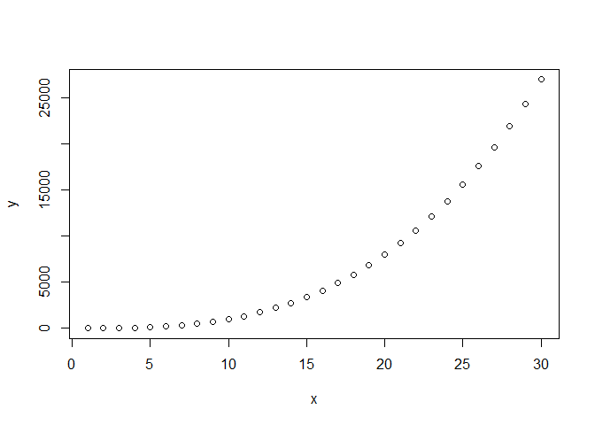

**Assignment 2: Web scrapping/Data Wrangling in R**
================
**Suman Paudel 33**
2024-03-03

[GitHub
Repository](https://github.com/sumanpaudel1997/R-For-Data-Science/tree/main)

## <span style="color:#d30000"> <b> Code Execution and Output/Interpretation of Session 4</b></span>

##### <span style="color:#7b9a26"> <b> Code Sample 1</b></span>

``` r
# vector 
x <- c(1:30)
y <- x^3
plot(x,y,)
```

<!-- -->

***Interpretation***:

- x is vector having elements 1 to 30.
- y is also vector having elements of x exponentiated of 3.
- plot is a generic function in R to plot, by default in R scatter plot
  is plotted.

##### <span style="color:#7b9a26"> <b> Code Sample 2</b></span>

``` r
# store the current working using following command:
initial.dir <- getwd()
initial.dir
```

    ## [1] "C:/Users/SumanPaudel/Desktop/R For Data Science"

***Interpretation***:

- **initial.dir** object will be assigned the current working directory.

##### <span style="color:#7b9a26"> <b> Code Sample 3</b></span>

``` r
# to change the working directory custom directory
setwd("C:/Users/SumanPaudel/Desktop/R For Data Science")
```

***Interpretation***:

- **setwd()** function will change the working directory to given path.
