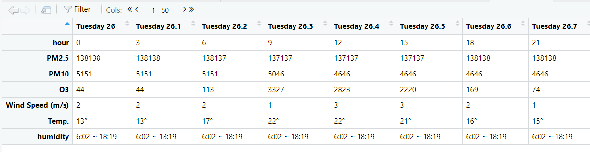
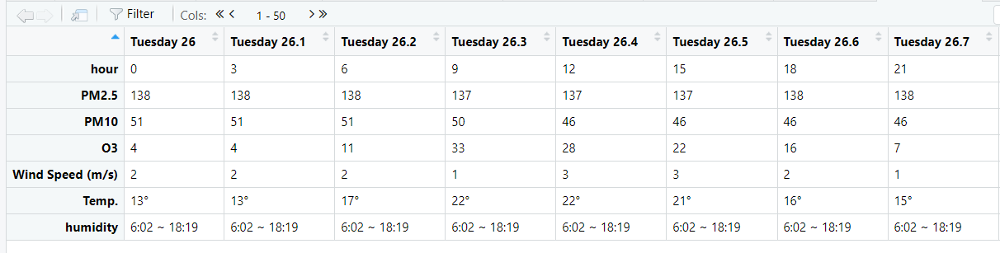

# **\textcolor{orange}{Part 1}**
#### **\textcolor{magenta}{Task 1}**
#### **Load all of the necessary packages need for task 1.**
```{r warning=FALSE, cache=TRUE, message=FALSE}
# Load the packages
library(foreign) 
library(gt)
library(tidyverse)
library(magrittr)
library(readxl)
```

###### Load the Data using CSV module from base R
``` {r cache=TRUE}
# load the data using Base R read.csv 
data <- read.csv("covnep_252days.csv")

summary(data$totalCases)
```

###### Since we need value as 1 instead of zero We can achieve this using \ multiple ways like ifelse or pmax or subsetting

###### **Using `ifelse`**
```{r cache=TRUE}
# using ifelse
totalCases_ifelse <- ifelse(data$totalCases < 1, 1, data$totalCases)
summary(totalCases_ifelse)
```

###### **Using `pmax`**
```{r cache=TRUE}
# using pmax
totalCases_pmax <- pmax(data$totalCases, 1)
summary(totalCases_pmax)
```

###### **Using `subsetting`**
```{r cache=TRUE}
# subsetting
totalCases_subsetting <- data$totalCases
totalCases_subsetting[totalCases_subsetting < 1] <- 1
summary(totalCases_subsetting)
```


#### **\textcolor{magenta}{Task 2}**

#### **Read the .sav file using foreign library's read.spss function**  

\

###### **For q01**
```{r cache=TRUE}
# read the .sav file using read_sav function from haven
saq_data <- read.spss("SAQ8.sav",to.data.frame=TRUE)

# for q1
q01 <- saq_data$q01

# computer mathematical operations
datalevels_q01 <- levels(q01)
freq_q01 <- as.numeric(table(q01))
percent_q01 <- as.numeric(round(prop.table(freq_q01) * 100, 1))
valid_percent_q01 <- as.numeric(round(prop.table(freq_q01) * 100, 1))
cum_percent <- cumsum(percent_q01)

# Create data frame
data <- data.frame(
  Levels = datalevels_q01,
  Freq = freq_q01,
  Percent = percent_q01,
  Val_Percent = valid_percent_q01,
  Cum_Percent = cum_percent
)

head(data)
```

```{r cache=TRUE}
# final version of calculated table for q01
data <- data %>% add_row(Levels = "Total", Freq = sum(data$Freq), 
                 Percent = sum(data$Percent), 
                 Val_Percent = sum(data$Val_Percent),
                 Cum_Percent = NULL)

# aethetics table using gt
data %>% gt(rowname_col = 'Levels') %>% 
  tab_header(title = md("Statistics makes me cry")) %>% 
  cols_label(Freq = "Frequency",
             Percent = "Percent",
             Val_Percent = "Valid Percent",
             Cum_Percent = "Cumulative Percent") %>% 
  sub_missing(missing_text = "")

```  

###### **For q03**

```{r cache=TRUE}
# extract q03

q03 <- saq_data$q03
datalevels_q03 <- levels(q03)
freq_q03 <- as.numeric(table(q03))
percent_q03 <- as.numeric(round(prop.table(freq_q03) * 100, 1))
valid_percent_q03 <- as.numeric(round(prop.table(freq_q03) * 100, 1))
cum_percent_q03 <- cumsum(percent_q03)

# convert the computed values into dataframe
data_q03 <- data.frame(
  Levels = datalevels_q03,
  Freq = freq_q03,
  Percent = percent_q03,
  Val_Percent = valid_percent_q03,
  Cum_Percent = cum_percent_q03
)

head(data_q03)
```

```{r cache=TRUE}
# add row for total
data_q03 <- data_q03 %>% add_row(Levels = "Total", 
                         Freq = sum(data_q03$Freq), 
                         Percent = sum(data_q03$Percent), 
                         Val_Percent = sum(data_q03$Val_Percent),
                         Cum_Percent = NULL)

# final version of calculated table
data_q03 %>% gt(rowname_col = 'Levels') %>% 
  tab_header(title = md("Statistic makes me cry")) %>% 
  cols_label(Freq = "Frequency",
             Percent = "Percent",
             Val_Percent = "Valid Percent",
             Cum_Percent = "Cumulative Percent") %>% 
  sub_missing(missing_text = "")

```

###### **For q06**

```{r cache=TRUE}
# extract q06
q06 <- saq_data$q06

# mathematical computation
datalevels_q06 <- levels(q06)
freq_q06 <- as.numeric(table(q06))
percent_q06 <- as.numeric(round(prop.table(freq_q06) * 100, 1))
valid_percent_q06 <- as.numeric(round(prop.table(freq_q06) * 100, 1))
cum_percent_q06 <- cumsum(percent_q06)

# convert into dataframe
data_q06 <- data.frame(
  Levels = datalevels_q06,
  Freq = freq_q06,
  Percent = percent_q06,
  Val_Percent = valid_percent_q06,
  Cum_Percent = cum_percent_q06
)
```

```{r cache=TRUE}
# add row for total
data_q06 <- data_q06 %>% add_row(Levels = "Total", 
                         Freq = sum(data_q06$Freq), 
                         Percent = sum(data_q06$Percent), 
                         Val_Percent = sum(data_q06$Val_Percent),
                         Cum_Percent = NULL)

# final version of calculated table
data_q06 %>% gt(rowname_col = 'Levels') %>% 
  tab_header(title = md("I have little experience of computer")) %>% 
  cols_label(Freq = "Frequency",
             Percent = "Percent",
             Val_Percent = "Valid Percent",
             Cum_Percent = "Cumulative Percent") %>% 
  sub_missing(missing_text = "")
```

###### **For q08**

```{r cache=TRUE}
# for q08
q08 <- saq_data$q08

# mathematical computation
datalevels_q08 <- levels(q08)
freq_q08 <- as.numeric(table(q08))
percent_q08 <- as.numeric(round(prop.table(freq_q08) * 100, 2))
valid_percent_q08 <- as.numeric(round(prop.table(freq_q08) * 100, 2))
cum_percent_q08 <- cumsum(percent_q08)

# convert into dataframe
data_q08 <- data.frame(
  Levels = datalevels_q08,
  Freq = freq_q08,
  Percent = round(valid_percent_q08,1),
  Val_Percent = round(valid_percent_q08,1),
  Cum_Percent = round(cum_percent_q08,1)
)
```

```{r cache=TRUE}
# add row for total
data_q08 <- data_q08 %>% add_row(Levels = "Total", 
                         Freq = sum(data_q06$Freq), 
                         Percent = sum(data_q08$Percent), 
                         Val_Percent = sum(data_q08$Val_Percent),
                         Cum_Percent = NULL)


# final version of calculated table
data_q08 %>% gt(rowname_col = 'Levels') %>% 
  tab_header(title = md("I have never been good at mathematics")) %>% 
  cols_label(Freq = "Frequency",
             Percent = "Percent",
             Val_Percent = "Valid Percent",
             Cum_Percent = "Cumulative Percent") %>% 
  sub_missing(missing_text = "")

```

#### **\textcolor{magenta}{Task 3}**
``` {r cache = TRUE}
mr_drugs <- read_xlsx("MR_Drugs.xlsx")

inco <- mr_drugs %>% select(starts_with('inco'))

transform_inco <- mr_drugs %>% select(starts_with('inco')) %>%
  colSums() %>%
  enframe("income", "N") %>%
  mutate(Percent = round(N / sum(N) * 100, 1))

transform_inco
```


``` {r cache = TRUE}
# get the frequencies of 0 and 1 and convert to dataframe
income_frequencies <- apply(inco, 2, table) %>% 
  t() %>% as.data.frame()
income_frequencies


transform_inco <- transform_inco %>% 
  mutate(`Percent of Cases` = 
           round(transform_inco$N / (transform_inco$N + income_frequencies[, 1]) * 100, 1))

transform_inco

```

#### **Mathematical Computation**
``` {r cache = TRUE}
# final version of calculated table
final_inco <- transform_inco %>% add_row(
  income = "Total",
  N = sum(transform_inco$N),
  Percent = round(sum(transform_inco$Percent),2),
  "Percent of Cases" = round(sum(transform_inco$`Percent of Cases`),2),)

# converting into percentage
final_inco$Percent <- paste0(sprintf("%.1f", final_inco$Percent),"%")
final_inco$`Percent of Cases` <- paste0(sprintf("%.1f", final_inco$`Percent of Cases`),"%")
final_inco

```

#### **Final Table using gt table**
``` {r cache = TRUE, out.width="60%"}
final_inco %>% gt(rowname_col = 'income') %>% 
  tab_spanner(label='Response',columns = c('N','Percent')) %>% 
  
  tab_header(title = md("$Income Frequencies")) %>% 
  tab_footnote(footnote = "a. Dichotomy group tabulated at value 1",
               placement = c('auto')) %>% tab_options(footnotes.multiline = FALSE)


```

\newpage

# **\textcolor{orange}{Part 2}**
#### **\textcolor{magenta}{Task 1}**

\

**Load the necessary library needed for Part 2**
``` {r cache = TRUE}
library(jsonlite) #for working with json data
library(RSelenium) #for web scraping of dynamic table
library(rvest) #scraping the webpage into tibble or df
library(netstat) #for selenium driver
library(stringr) #string manipulation
```


``` {r cache = TRUE, out.width="60%"}
data_1 = 'https://data.covid19india.org/v4/min/timeseries.min.json'
data_2 = 'https://data.covid19india.org/v4/min/data.min.json'
covid_data_1 <- jsonlite::fromJSON(data_1)
covid_data_2 <- jsonlite::fromJSON(data_2)

knitr::include_graphics('cov.png')
```

**Sample of raw json data for first record**

``` {r cache = TRUE, out.width="100%"}

covid_1_parsed <-
  covid_data_1 %>% enframe() %>% unnest_wider(value) %>% unnest_wider(dates) %>% 
  pivot_longer(cols = !name,
               names_to = 'date',
               values_to = "value") %>% unnest_wider(value)


```

**Sample parsed till dates**

``` {r cache = TRUE, out.width="100%"}

num_rows <- nrow(covid_1_parsed)
selected_rows <- sample(1:num_rows, 1000)
covid_1_parsed_subset <- covid_1_parsed[selected_rows, ]

knitr::include_graphics("covid2.png")

```

``` {r cache = TRUE, out.width="100%"}

covid_1_parsed_subset <- covid_1_parsed_subset %>%
  mutate(across(c(delta, delta7, total), ~ map(., ~ set_names(  as_tibble(.x), paste0(cur_column(), "_", names(.)))))) %>%
  unnest_wider(c(delta, delta7, total))
covid_1_parsed_subset
```

``` {r cache = TRUE}
# delta parsed
covid_1_parsed_subset[80:150,] %>% select(starts_with('delta'))

# delta7 parsed
covid_1_parsed_subset[345:451,] %>% select(starts_with('delta'))

# total parsed
# for delta variants
covid_1_parsed_subset[789:885,] %>% select(starts_with('total'))
```

``` {r cache = TRUE}

covid_2_parsed <-
  covid_data_2 %>% enframe() %>% unnest_wider(value) %>%
  unnest_wider(c(delta, delta21_14, delta7, total), names_sep = "_") %>% select(-c(districts, meta))

```

``` {r cache = TRUE}

# for delta
covid_2_parsed %>% select(starts_with('delta'))

# for delta7
covid_2_parsed %>% select(starts_with('delta7'))

# for delta21-_14
covid_2_parsed %>% select(starts_with('delta2'))

# for total
covid_2_parsed %>% select(starts_with('total'))

```


``` {r cache = TRUE}

# merge into single file
merged_df <- merge(covid_1_parsed_subset, 
    covid_2_parsed, 
    by.x = "name", 
    by.y = "name",
    sort = T,
    all = F)

head(merged_df)

```

#### **\textcolor{magenta}{Task 2}**
#### Webscraping of Dynamic Table AQI Kathmandu 

``` {r cache = TRUE}

# load the webdriver for firefox
rD <- rsDriver(browser="firefox",verbose = F, port = 14421L)
remDr <- rD[["client"]]
remDr$navigate("https://aqicn.org/forecast/kathmandu/")
aqi_html  <- read_html(remDr$getPageSource() %>% unlist())

# scrape the needed table for data analysis
aqi_html %>% html_element(".forecast-body-table") %>%  
  html_nodes("table") %>% 
  html_table() -> 
  forecast_table

```


``` {r cache = TRUE, out.width="100%"}

# since forecast consist the list of dataframe
# extracted first value from the list which conists the required dataframe
aqi_table <- forecast_table %>% .[[1]]


```

#### **Data Wrangling the forecast Table AQI Kathmandu**
- **Step 1**: Remove null columns that came while parsing  
`aqi_table %>%  select(-c('X10','X11','X20','X21','X30','X31','X40','X41','X50','X51','X60','X61'))`
- **Step 2**: Filter out rows with 'UVI' and 'humidity' in the 'X1' column where entire row is NULL
 \ `aqi_table %>% filter(X1 != 'UVI')` and `aqi_table %>% filter(X1 != 'humidity')`
- **Step 3**: Replaced the value in the 'X1' column at index 9 with 'humidity' \ `aqi_table %>% mutate(X1 = replace(X1, 9, "humidity"))`
- **Step 4**: Replaced the value in the 'X1' column at index 1 with 'Index' \
  `aqi_table %>% mutate(X1 = replace(X1, 1, "Index"))`
- **Step 5**: Filter out rows with empty values in the 'X1' column \
  `aqi_table %>% filter(X1 != '')`
- **Step 6**: Assigned the first row of the data frame as the column headers \
`headers <-  aqi_table[1,]` \
`colnames(aqi_table) <- headers`
- **Step 7**: Remove the first row of the data frame `aqi_table <- aqi_table[-1,]`
- **Step 8**: Converted the 'Index' column to row names `aqi_table %>% 
  column_to_rownames(var = 'Index')`
  
``` {r cache = TRUE, out.width="100%"}
# extract first value from list
aqi_table <- forecast_table %>% .[[1]]

# delete null columns
aqi_table <- aqi_table %>% 
  select(-c('X10','X11','X20','X21','X30','X31','X40','X41','X50','X51','X60','X61'))

# remove null row 'UVI'
aqi_table <- aqi_table %>% filter(X1 != 'UVI')

# since value of humidity interchange for now I have removed empty row.
aqi_table <- aqi_table %>% filter(X1 != 'humidity')

# now I have assigned the value at 1st column 9th row as 'humidity'
aqi_table <- aqi_table %>% mutate(X1 = replace(X1, 9, "humidity"))

# now I have assigned the value at 1st column 1st row as 'Index'
aqi_table <- aqi_table %>% mutate(X1 = replace(X1, 1, "Index"))

# finally remove the last empty row
aqi_table <- aqi_table %>% filter(X1 != '')

# setting first row as headers
headers <- aqi_table[1,]
colnames(aqi_table) <- headers

# dropping the first row as header has been set.
aqi_table <- aqi_table[-1,]

# now setting the index or row name as 'Index' column
aqi_table <- aqi_table %>% column_to_rownames(var = 'Index')


```
**Sample Parsed AQI Table**  
**Note** Still some changes needs to be done on `hour`, `PM2.5`, `PM10` and `O3` as values are concatenated wrongly while parsing html.


``` {r cache = TRUE, out.width="100%"}

aqi_table[2,] <- 
  floor(as.integer(str_extract(as.character(aqi_table[2,]), "\\d+")) / 1000)
aqi_table[3,] <- 
  floor(as.integer(str_extract(as.character(aqi_table[3,]), "\\d+")) / 100)

lengths <- as.numeric(nchar(aqi_table[4,]))
aqi_table[4,] <- 
  ifelse(lengths == 2, substr(aqi_table[4,], 1, 1), 
  ifelse(lengths %in% 3:4, substr(aqi_table[4,], 1, 2), ""))

aqi_table
```


``` {r cache = TRUE, out.width="100%"}

```
**Final Version of Cleaned AQI Table**

\newpage

# **\textcolor{orange}{Part 3}**

**Load the necessary library needed for Part 3**
``` {r cache = TRUE}

library(pdftools) # for working with pdf files
library(tm) # for text mining
library(wordcloud) # plotting word cloud
library(Rgraphviz) # plotting network like graph for word association 
library(graph) # plotting network like graph for word association 
library(ggplot2) # for bargraph
```

**Load the pdf files and convert it to Corpus**
``` {r cache = TRUE, out.width="100%"}
# load the file path in list 
files <- list.files(pattern = "pdf$")
```

``` {r cache = TRUE, out.width="100%"}
# load the pdf files into list
pdf_files <- lapply(files, pdf_text)
```

``` {r cache = TRUE, out.width="100%"}
# create a corpus from vector source i.e from list pdf_files
corpus <- Corpus(VectorSource(unlist(pdf_files)))
# copy the loaded corpus
corpus_copy <- corpus
```

``` {r cache = TRUE, out.width="100%"}
# inspect first few texts of corpus
inspect(corpus[1:2])
```

**Text Mining Preprocessing**
- Step 1: Convert all texts to lowercase
- Step 2: Remove punctuations
- Step 3: Remove numbers
- Step 4: Remove stopwords or user defined stopwords
- Step 5: Stem the corpus
- Step 6: Remove specific words which doesn't help the corpus
- Step 7: Create Term Document Matrix


``` {r cache = TRUE, out.width="100%"}
# convert the all texts in lower
corpus <- tm_map(corpus, tolower)
inspect(corpus[1:2])
```

``` {r cache = TRUE, out.width="100%"}
# remove punctuations
corpus <- tm_map(corpus, removePunctuation)
```

``` {r cache = TRUE, out.width="100%"}
# stem the corpus
corpus <- tm_map(corpus, stemDocument)
```

``` {r cache = TRUE, out.width="100%"}
remove <- function(x) gsub("values","value",x)
corpus <-  tm_map(corpus, remove)
```


``` {r cache = TRUE, out.width="100%"}

# create Term Document Matrix with word length 1 or many
tdm <- TermDocumentMatrix(corpus, control = list((wordLenghts=c(1,Inf))))

```

**Best way to create a Term Document Matrix with preprocessing**
``` {r cache = TRUE, out.width="100%"}
remove <- function(x) gsub("values","value",x)
corpus_copy <-  tm_map(corpus_copy, remove)
my_tdm <- TermDocumentMatrix(
  unlist(corpus_copy),
  control =
    list(
      removePunctuation = TRUE,
      stopwords = TRUE,
      tolower = TRUE,
      stemming = FALSE,
      removeNumbers = TRUE,
      bounds = list(global = c(3, Inf)),
      wordLenghts = c(1,Inf),
      removeWords = (c("can","may","used")))
)
```

**Most Frequent Terms**
``` {r cache = TRUE, out.width="100%"}

# finding frequency of words which is at least present 10 times
low_frequent_terms <- findFreqTerms(my_tdm, lowfreq = 10)
head(low_frequent_terms)
# finding frequency of words which is at max present 10 times
high_frequent_terms <- findFreqTerms(my_tdm, highfreq = 10)
head(high_frequent_terms)
```

**Associated terms of the most frequent term**

``` {r cache = TRUE, out.width="100%"}

# associated terms for mining with correlation 0.3
findAssocs(my_tdm, "mining", 0.3)

# associated terms for mining with learning 0.3
findAssocs(my_tdm, "learning", 0.35)

# associated terms for mining with data 0.3
findAssocs(my_tdm, "data", 0.4)
```

**Top 10 words and their respective counts**
``` {r cache = TRUE, out.width="100%"}

# top 10 words and their respective counts 

df <-
  my_tdm %>%
  as.matrix() %>%
  rowSums() %>%
  sort(decreasing = TRUE) %>%
  head(10) %>%
  enframe(name = "word", value = "counts")

df
```

**Bargraph of top 10 words and their respective counts**

``` {r cache = TRUE}

# using ggplot2
bargraph <- ggplot(df, aes(word, counts)) +
  geom_bar(stat = "identity", fill = "#E69F00") +
  theme(axis.text.x = element_text(angle = 45, hjust = 1)) +
  labs(title = "Top 10 words by counts.") +
  geom_text(aes(label = counts), vjust = -0.5) +
  ylim(0, 10000L)

bargraph
```

**Correlation between top 600 frequent terms**

``` {r cache = TRUE}

top_600_frequent_tems <- findFreqTerms(my_tdm, lowfreq = 650)
plot(my_tdm, terms = top_600_frequent_tems, corThreshold = 0.2, weighting = T)


```

**Topic Models**

``` {r cache = TRUE}

# topic models
library(topicmodels)
set.seed(123)

lda <- LDA(my_tdm, k=4)

```

``` {r cache = TRUE}

# terms
head(terms(lda,3))

# topics
head(topics(lda))

```
